_Mantra of the day_: SpikeInterface-GUI is used to create a **Curation** file. 

We'll come back to this...

The goal of today is to take a look at our spike sorting results using SpikeInterface-GUI. Alternative GUIs include [Phy](https://github.com/cortex-lab/phy) and [SortingView](https://github.com/magland/sortingview). Once we look at the sortings, we'll realise that all spike sorters make mistakes. To try and remedy some of these mistakes, we'll curate the output. Before getting started, let's do a very quick review of what we've done so far so that we're all on the same page.

## Review of previous material

On Monday and Tuesday we saw how to take raw ephys data, preprocess it, sort it and compute properties of that sorting. When you're making a spike sorting pipeline you have lots of things to check and decisions to make. But once you've got the pipeline fixed, the final code is often quite simple. Here's an example of a full basic pipeline for a chronic recording:

```{python}
import spikeinterface.full as si

raw_recording = si.read_nwb('path/to/data')
prepreocessed_recording = si.bandpass_filter(
    si.common_reference(
        raw_recording
    )
)

sorting = si.run_sorter(
    sorter_name="lupin", 
    recording=prepreocessed_recording
)

analyzer = si.create_sorting_analyzer(
    sorting=sorting,
    recording=preprocessed_recording,
    format="binary_folder",
    folder="derivatives/my_sorting_analyzer"
)

extensions_dict = {
    'random_spikes': {},
    'templates': {},
    'waveforms': {},
    'noise_levels': {},
    'correlograms': {},
    'spike_amplitudes': {},
    'spike_locations': {},
    'unit_locations': {},
    'template_similarity': {},
}

analyzer.compute(extensions_dict)
```

If you have annoying things like motion, artefacts, seperate shanks, a custom probe, multiple recordings, etc you'll need to modify this simple pipeline. But this is a good starting point! The end goal of a SpikeInterface pipeline is the `SortingAnalyzer` - and this code makes one!

While we were preprocessing and spike sorting on Monday and Tuesday, we created an analyzer from a 90 second snippet of a recording from Adrian Duszkiewicz available at [this DANDIlink](https://dandiarchive.org/dandiset/000939/0.260512.1701/files?location=sub-A3702). You can keep using this if you'd like. However, it will be more fun (and realistic) to use a longer recording. I've made an analyzer computed using the same recording as we used earlier in the week, but sorted using the full 2 hour duration of the recording. You can download it HERE, or it's also on a usb stick in the room. Whether you use the short or long analyzer, please make a note of where it is stored. We'll say that the analyzer is at `path/to/analyzer`. Change this when you see it.

_Mantra of the day_: SpikeInterface-GUI is used to create a **Curation** file.

So... what's SpikeInterface-GUI?

## Visualizing the Analyzer with SpikeInterface-GUI

We'll use SpikeInterface-GUI to visualize our spike sorting results. Read more [on the SpikeInterface-GUI github page](https://github.com/SpikeInterface/spikeinterface-gui/). When building our Python environment, SpikeInterface-GUI was already included, so we should be able to run it from the terminal by activating our environment (if it's not already active) then running:

```{python}
sigui path/to/analyzer
```

This launches the GUI in "visualization" mode. Something like the following window should have appeared:

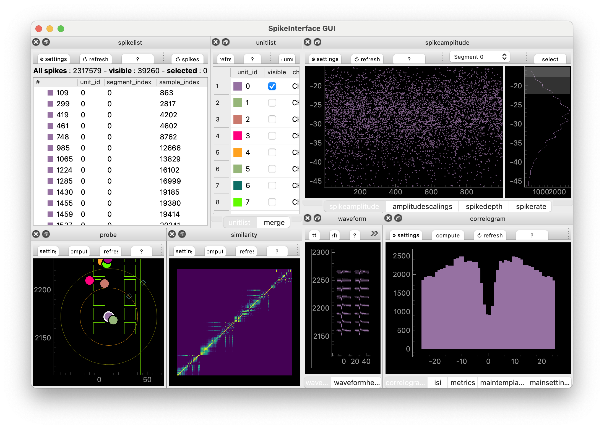

The window consists of many **Views**. Roughly: each View displays properties from one of the analyzer extensions.

We'll now explore the GUI together at the workshop. If you're not at the workshop, one key piece of information is that each View has a little box with a question mark in it. Click it to find out more about each View, including useful keyboard shortcuts.

You can also run the GUI from a Python script or Jupyter notebook, like so:

```{python}
import spikeinterface.full as si
from spikeinterface_gui import run_mainwindow

sorting_analyzer = si.load('path/to/analyzer')
run_mainwindow(
    sorting_analyzer
)
```

This can be handy when you want a bit more control over what you pass to the GUI.

::: {.callout-tip collapse="true"}
### Customizing the GUI

The GUI supports 27 (and counting!) different Views, which you can lay out (in a Layout) however you'd like. We have some pre-defined layouts which you can try out, e.g.:

```{python}
sigui --layout-preset unit-focus path/to/analyzer
```

The available layout-presets are "unit-focus", "??" and "??".

You can also make custom layouts in a json file. Here's a simple example:

```
{
    "zone1": ["amplitudescalings"],
    "zone2": [],
    "zone3": ["waveform"],
    "zone4": [],
    "zone5": ["unitlist"],
    "zone6": ["probe"],
    "zone7": [],
    "zone8": []
}
```

We simply save the layout dictionary in a json file (by copying and pasting the text into a empty file - I'll call it "my_custom_layout.json") and point to it using the terminal:

```{python}
sigui --layout-file path/to/my_custom_layout.json path/to/analyzer
```

When run, you should get a window that looks like this:

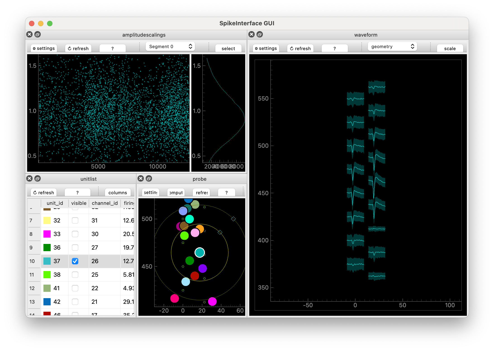

Nice! We used "zones" to define where things go. The zones are described in more detail on the [SpikeInterface-GUI GitHub page](https://github.com/SpikeInterface/spikeinterface-gui/). Roughly they are the eight boxes that make up the GUI:

```
+---------------+--------------+
| zone1   zone2 | zone3  zone4 |
+               +              +
| zone5   zone6 | zone7  zone8 |
+---------------+--------------+
```


You can also change settings in individual views, then go to the MainSettings View and click "Save as default settings".
:::

_Mantra of the day_: SpikeInterface-GUI is used to create a **Curation** file. 

So... what's a Curation. And why does it have a capital C?

## Why curate?

Spike sorters make mistakes -- sometimes lots of mistakes! So we need to look at the spike sorting output. Then we can adjust the sorter's default settings (then take a look at the results) in the hope that their output improves, or we can curate what comes out of them.

See the [Glossary](glossary.qmd#units-neurons-and-clusters) for the course-wide terminology used below.
It's helpful to remind ourselves what the approximate definitions of "neuron" and "unit" are:

  - **Neuron**: a neuron, an actual cell.
  - **Unit**: something a spike sorter thinks is a neuron

Note that some people call units "clusters" or "putative neurons". 

Common "mistakes" that spike sorters make are:

  1) Include a unit which is clearly noise or caused by an artefact
  2) Take the spikes from one neuron but sorts them into two units (over-splitting)
  3) Takes the spikes from two neurons but sorts them into one unit (over-merging)

To counter these errors we need to

  1) Label the units, to indicate their quality
  2) Merge over-split units
  3) Split over-merged units

In SpikeInterface a **Curation** is a list of decisions, formalised into a Curation class (which we won't worry much about). These decisions are labels, merges and splits. As we proceed, we'll create **Curation**s by using the GUI or by using tools inside SpikeInterface.

## Manual Labelling

First, we will try to attach quality labels to units using some different approaches. The labels we'll use are

  - **good**: this unit looks like a single, well sorted neuron
  - **mua** (multi-unit activity): this looks like a real neural signal, but it doesn't come from a single neuron
  - **noise**: this does not come from a neural signal

::: {#tip-science .callout-tip collapse="true"}
### The curation you use depends on your science

Suppose you are interested in very specific cells. Ones that only respond to certain stimuli and live in a specific brain area. You're expecting to record from only a handful of these neurons per recording. In this case, your scientific question depends sensitively on the fact you're looking at a good unit. Hence you need to go in a surgically check that each unit you keep is "good".

On the other hand, suppose you're looking at population level questions. How does the overall firing rate different between brain states? What are the low-dimensional dynamics? In this case, the individual nature of each unit may be less important. Hence you can be a bit less careful: get rid of the stuff that's obviously noise and continue.

Overall: the curation you use depends on your scientific question and your downstream methods.
:::

To make a Curation, we launch SpikeInterface-GUI in "curation" mode. We can do that either in the terminal

```{python}
sigui --curation path/to/analyzer
```

Or in a python script

```{python}
import spikeinterface.full as si
from spikeinterface_gui import run_mainwindow

sorting_analyzer = si.load('path/to/analyzer')
run_mainwindow(
    sorting_analyzer,
    curation=True,
)
```

"Curation mode" allows us to label units (and merge and split them). We can label a unit as "good" by typing "g", "mua" by typing "m" and "noise" by typing "n". We'll now all manually curate our analyzers, but how do we determine if a unit is "good", "mua" or "noise"?

### Curation: auto-correlograms

After spiking, a neuron has to [rest for a while](https://en.wikipedia.org/wiki/Refractory_period_(physiology)). So if a unit has two spikes within e.g. 1ms of each other, that's a sign that something in the sorting has gone wrong since it is not physiologically possible for neurons to fire that rapidly. 

The auto-correlogram helps you see these "refractory period violations". To make the auto-correlogram plot, you ask: how many spikes occur between 0-1ms after another spike. Count them and plot them as a bar. Then: how many spikes occurs between 1-2ms after another spike? Then 2-3ms? And so on. Here's a not-too-busy auto-correlogram:

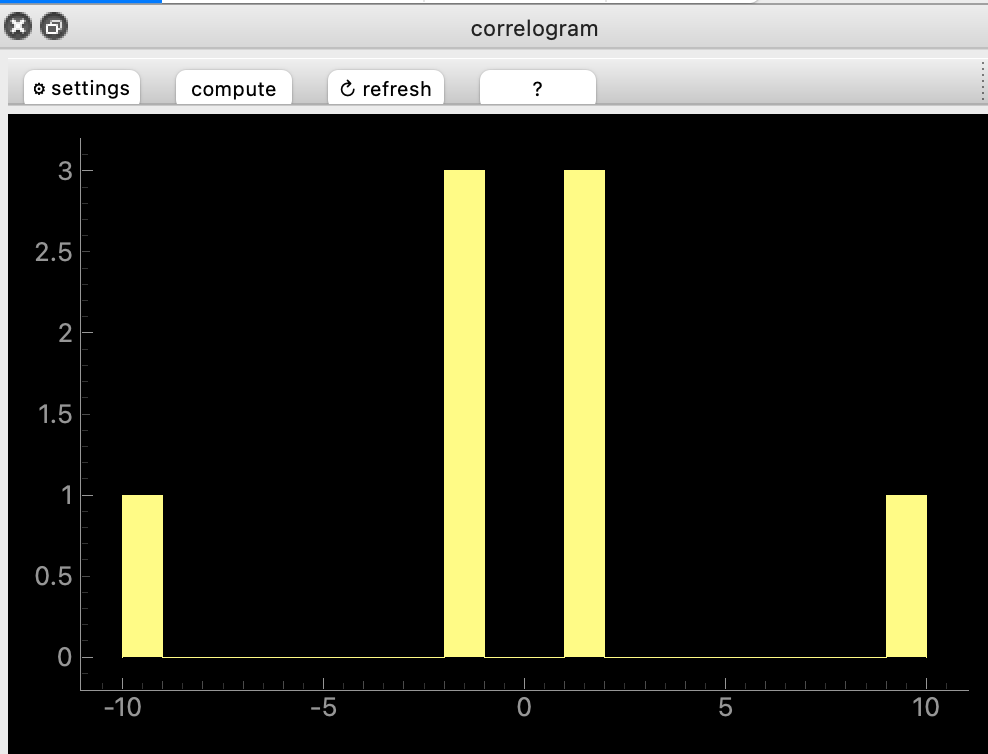{width="50%"}

"Good" unit have almost no violations near 0ms. Many violations mean that the unit is contaminated with noise, or another unit. Here are a couple of examples:

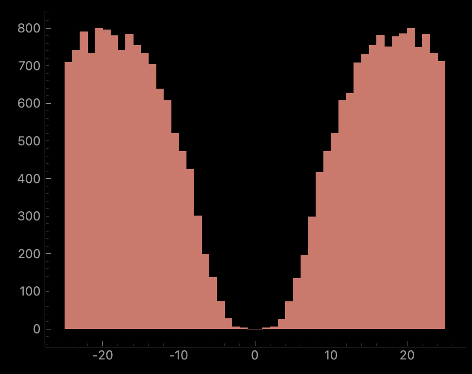{width="50%"}

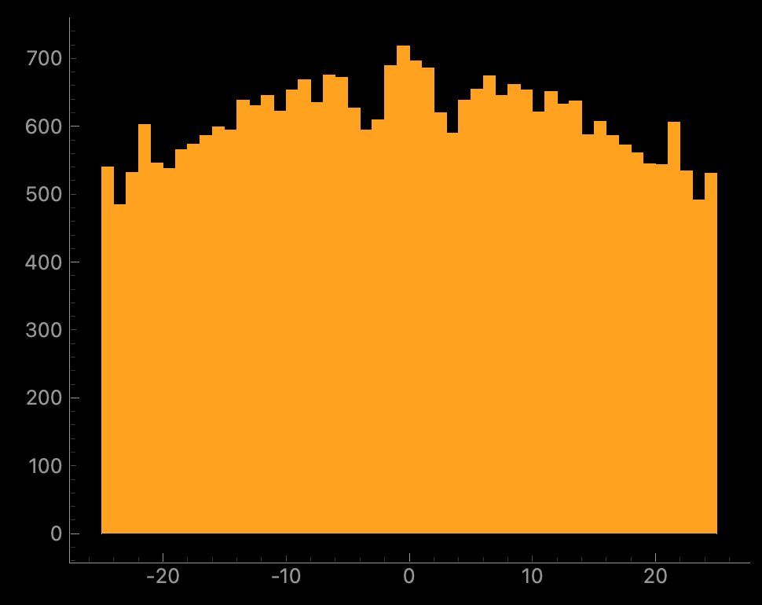{width="50%"}

Whether the "not good" units should be labelled "noise" or "mua" will depend on other properties.

### Curation: templates

The spatio-temporal electrical signal we measure when a neuron spikes is called a waveform. The "template" is the average of all these waveforms. For high-density probes (e.g. NeuroPixels, other probes etc) the signal is spread across many channels. A "good" unit should have a template that looks like an (extra-cellular) action potential. Here's an example, plotted with the probe map and with the "maximum signal channel" plotted:

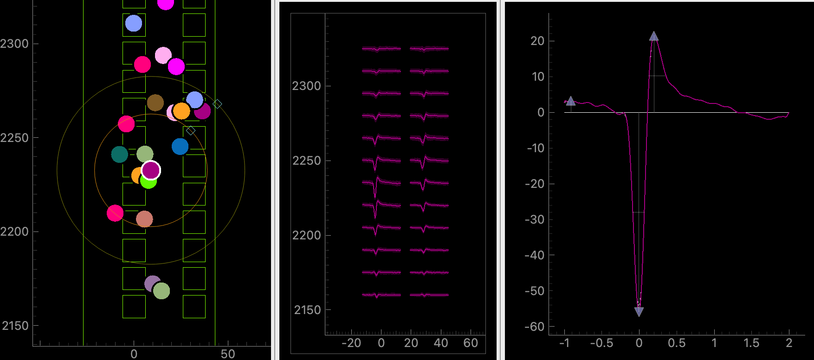

In the left plot, the squares represent channels on the probe. Each colourful circle represents the (approximate) location of each unit. We have selected the purple unit with a white boundary. In the middle plot, the template of the unit is plotted on several channels. The layout of the channels in the middle plot match the layout in the left plot. In the right plot, we plot the template on the channel where the template is "biggest".

We see that the purple unit location on the probe matches where the peak of the signal is on the template plot. This unit looks "good" (to me) because 1) it's temporally localized (the signal is localised in the x-axis) 2) it has spatial decay (the signal, and its peak gets smaller as you move away from the "biggest" channel) 3) it has a trough, then a peak 4) it goes to zero on both sides of the x-axis. Note on the "main channel" view we can see that the unit's extrema value is -60uV.

Here's clear noise:

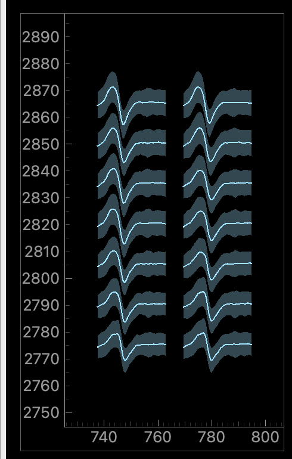{width="50%"}

Here, the signal is the same on all electrodes (no spatial decay), it's temporally quite wide, it doesn't reach zero as you approach the left x-axis.

And here's something more ambiguous:

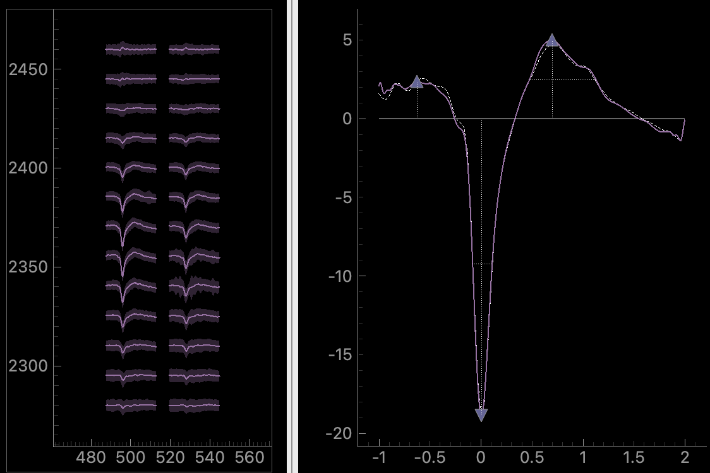

Here, there is some spatial decay. But temporally, it doesn't start from zero and it doesn't decay to zero smoothly. The unit's peak is about -20uV, so it's much smaller than the good unit we saw earlier. These small units are more likely to get some noise mixed into them (because they are harder to distinguish from noise). So maybe it's a real unit with some noise mixed in? Or maybe it's just a good unit which is further away from the probe. You need to look at more plots to decide on this one...

### Exercise: manually curate the analyzer for 10 minutes

Jot down any units you were unsure what to do with and we'll take a look at them soon.

When you're done, export your curation using the "Export Curation" button. This will produce a json file containing your decisions.

## Automated labels with metrics

Manual curation isn't fun. It also has genuine scientific issues: human decisions are inconsistent. If you do the same curation exercise tomorrow, you'll get a different result. If you're hungry, you'll probably be harsher on your units. If you've not seen a good unit for a while, you'll be desperate to label one as "good"! 

So, we can try to automate the process. We'll try three different methods, all based on **Metrics**.

In our context a metric is a number which measures a property of the spike sorted unit. Let's see some common examples (the text here is adapted from the [UnitRefine paper](https://www.biorxiv.org/content/10.1101/2025.03.30.645770v2) by Jain et al.)

  - **Firing rate**: The number of spikes in the cluster divided by the length of the recording (in seconds).
  - **Signal to noise ratio** (SNR): the amplitude of the template on the extremal channel, divided by the standard deviation of the noise on this channel.
  - **ISI violation count** The number of inter-spike-interval (ISI) violations that occured for each cluster.
  - **ISI violation ratio**: Given the ISI violations count, the ISI violations ratio approximates the contamination rate of the cluster, assuming random contamination.

And some less common, but potentially just-as-important, ones (don't worry about understanding all these in detail, I'm just providing some explanations to show you that metrics measure different things, and that they are non-trivial to compute!):

  - **SD ratio**: Compute the spike amplitudes for a simulated cluster composed of many snippets of noise,  giving a noise-amplitude distribution. The sd ratio is equal to the standard deviation of the cluster's amplitude distribution divided by the standard deviation of the noise-amplitude distribution.
  - **Amplitude cutoff**: For each cluster, make a histogram of spike amplitude values. Assume the distribution is normally distributed and fit the distribution using the high-value tail. Under this assumption, estimate how many spikes are missing from the low-value tail. The amplitude cutoff is equal to the estimated fraction of spikes missing from the tail.
  - **Drift ptp (peak-to-peak)**: The difference between the maximum and minimum values in the spike location difference distribution.
  - **Sync\_n**: Take all spike times from a cluster. Count all spikes which occur at the same timepoint (sample) as at least $n-1$ spikes from all other clusters. sync\_n is equal to this count.
  - **Exp decay**: On every channel, find both the maximum amplitude and the distance from the extremal channel. Use this to produce amplitude as a function of distance A(d). Fit this function to an exponential decay $A(d) \sim exp(−ad)$. The metric exp decay is equal to the decay rate $a$.

Read more about the metrics either at the [UnitRefine paper](https://www.biorxiv.org/content/10.1101/2025.03.30.645770v2), or in the [SpikeInterface docs](https://spikeinterface.readthedocs.io/en/stable/modules/metrics.html). As you can see, they all measure properties of different aspects of the unit: the size of the signal, non-biological spike times, properties of the amplitude and depth distributions etc etc. There are around 40 metrics in SpikeInterface and each has its own intricacies.

In SpikeInterface, the metrics are contained in extensions. At the moment we separate them into two groups: quality metrics and template metrics. You can compute them in a similar way you computed other `SortingAnalyzer` extensions:

```{python}
sorting_analyzer.compute(['quality_metrics', 'template_metrics'])
```

This will compute all the metrics which it can - the metrics you compute will depend on which other extensions you've computed. E.g. if you've not computed spike depths you won't get any of the drift metrics. If you've not computed noise levels, you won't get the signal-to-noise ratio. The other extensions we've computed already will give us access to most of the metrics.

After you've computed them you can see the metrics in a pandas dataframe as follows:

```{python}
all_metrics = si.get_metrics_extension_data(sorting_analyzer)
print(all_metrics)
```

### Thresholding

The simplest approach to decide whether units are "good" based on metrics is to _threshold_. This means: define some boundaries and only take units whose metrics fall within those boundaries. Here's an example:

```{python}
qm_thresholds = {
    "snr": {"greater": 5},
    "firing_rate": {"greater": 0.1, "less": 200},
    "rp_contamination": {"less": 0.5}
}
```

Based on these thresholds, we can get labels ("good" or "noise") for all your units:

```{python}
all_metrics = sorting_analyzer.get_metrics_extension_data()
qm_labels = si.threshold_metrics_label_units(
    all_metrics, thresholds=qm_thresholds, column_name="simple_threshold"
)
good_units = qm_labels.query('simple_threshold == "good"')
print(f"{len(good_units)}/{len(qm_labels)} are good!")
```

Finally, we can attach the labels to the `sorting_analyzer` and launch the GUI, allowing us to take a look at what we've done:

```{python}
sorting_analyzer.set_sorting_property(
    key='simple_threshold', values=qm_labels['simple_threshold'].values.astype(str)
)
run_mainwindow(
    sorting_analyzer
)
```

Usually thresholding is a strict tool. Your unit has to pass every test you give it for it to be included as a good one. Sometimes you want to be more lenient with one threshold when another criteria is met. So generally, I would advise against simple thresholding. But it's a good place to start.

### Bombcell: _extreme_ Thresholding

I think of Bombcell, developed by Julie Fabre, as _extreme_ thresholding. Roughly your unit goes through a decision tree, and depending on the metrics, it will get a different label. The decision tree is carefully thought out and takes into account a diverse range of metrics. Take a look at the decision tree on the [Bombcell GitHub page](https://github.com/Julie-Fabre/bombcell).

The good news for us is that Julie agreed to port Bombcell over to SpikeInterface. Hence we can use it on our analyzer in a one-liner:

```{python}
bombcell_labels = si.bombcell_label_units(sorting_analyzer)
print(bombcell_labels)
```

Let's take a look at the results:

```{python}
sorting_analyzer.set_sorting_property(key='bombcell_labels', values==bombcell_labels['bombcell_label'].values.astype(str))
run_mainwindow(
    sorting_analyzer
)
```

There are also plotting tools so that you can see _why_ Bombcell labelled your units as it did. For example, here is an "upset plot":

```{python}
si.plot_bombcell_labels_upset(sorting_analyzer, unit_labels=bombcell_labels['bombcell_label'])
```

This tells us which metrics made units fail. After looking at your results, you might decide to change the default parameters. To do so, you can first check out the default params:

```{python}
## it's worth "pretty printing" this dict...
from pprint import pprint
default_thresholds = si.bombcell_get_default_thresholds()
pprint(default_thresholds)
```

Then decide which to change, and feed these into your labelling function:

```{python}
custom_thresholds = {
    'mua': {
        'amplitude_cutoff': {'greater': None, 'less': 0.1},
        'amplitude_median': {'abs': True, 'greater': 30, 'less': None},
        'drift_ptp': {'greater': None, 'less': 100},
        'num_spikes': {'greater': 300, 'less': None},
        'presence_ratio': {'greater': 0.7, 'less': None},
        'rp_contamination': {'greater': None, 'less': 0.1},
        'snr': {'greater': 5, 'less': None}},
    'noise': {
        'exp_decay': {'greater': 0.01, 'less': 0.1},
        'num_negative_peaks': {'greater': None, 'less': 1},
        'num_positive_peaks': {'greater': None, 'less': 2},
        'peak_after_to_trough_ratio': {'greater': None, 'less': 0.8},
        'peak_to_trough_duration': {'greater': 0.0001, 'less': 0.00115},
        'waveform_baseline_flatness': {'greater': None, 'less': 0.5}},
    'non-somatic': {
        'main_peak_to_trough_ratio': {'greater': None, 'less': 0.8},
        'peak_before_to_peak_after_ratio': {'greater': None, 'less': 3},
        'peak_before_to_trough_ratio': {'greater': None, 'less': 3},
        'peak_before_width': {'greater': 0.00015, 'less': None},
        'trough_width': {'greater': 0.0002, 'less': None},
    }
}

bombcell_labels = si.bombcell_label_units(
    sorting_analyzer,
    thresholds = custom_thresholds
)
```

### UnitRefine: Train yourself out of a job

In UnitRefine ([preprint](https://www.biorxiv.org/content/10.1101/2025.03.30.645770v2) + [gitub repo](https://github.com/anoushkajain/UnitRefine.git)), you start with a small (say, 1000 units) manually labelled dataset. UnitRefine then use machine learning to train a classifier based on this labelled data and the metrics of each unit. Then these classifiers should mimic the people who originally did the labelling. 

The hardest problem isn't training the classifiers - it's getting good labelled data. Studies show that humans agree approximately 80% of the time [Jain et al., 2025](https://www.biorxiv.org/content/10.1101/2025.03.30.645770v2), so this gives a ceiling on how well a classifier can mimic a group of manual curators.

There are some pre-trained classifiers available on [HuggingFaceHub from Anoushka Jain](https://huggingface.co/AnoushkaJain3). The underlying data was curated by five different people. Let's try it out:

```{python}
unitrefine_labels = si.unitrefine_label_units(
    sorting_analyzer,
    noise_neural_classifier="AnoushkaJain3/noise_neural_classifier_lightweight",
    sua_mua_classifier="AnoushkaJain3/sua_mua_classifier_lightweight",
)

sorting_analyzer.set_sorting_property(
    key='bombcell_labels', values==bombcell_labels['bombcell_label'].values.astype(str)
)
run_mainwindow(
    sorting_analyzer
)
```

The basic system we've used uses two binary classifiers: one classifies units into "noise" and "neural", the second into "sua" ("good") and "mua".

Another option is to train your own classifier. When you train yourself you can use any labels, and any number of labels, that you'd like. I'll do a demo of this in the workshop. You can try it yourself by following the instructions on the [UnitRefine GitHub repo](https://github.com/anoushkajain/UnitRefine.git):, and there is also a [video tutorial](https://youtu.be/UKYDipSY7B4).

### Comparing methods

We've now tried three labelling methods and we've been storing their results in the analyzer. So, we can now compare all three methods in the GUI. 

## Merging

We'll try out some auto-merge tools from the GUI. Launch the gui using the "merge_focus" layout-preset as follows:

```{python}
sigui --curation --layout-preset merge_focus path/to/analyzer
```

(As these command line commands get more complicated, you might see why you want to run SpikeInterface-GUI from a Python script rather than from terminal!)

You should see something like this:

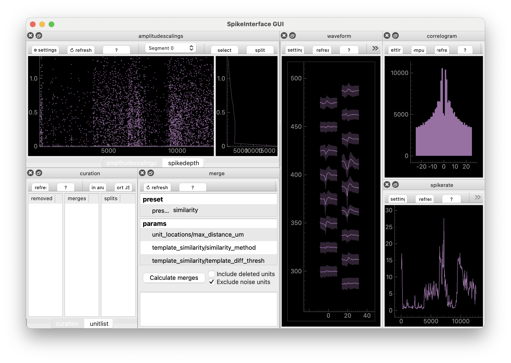

You can now use "MergeView" to try out some auto-merge methods. The one that is initially selected is "template_similarity". This simply takes the templates of each unit and checks how similar they are (by subtracting them from one another, then taking the root of the sum of the squared differences - called the L2 distance between templates). Click "compute" and a list of potential merges will appear. The idea here is: the algorithm has suggested a bunch of potential merges. Now you need to decide which ones you agree with. To agree you either press `ctrl+A` (`cmd+A` on mac) or right-click the merge.

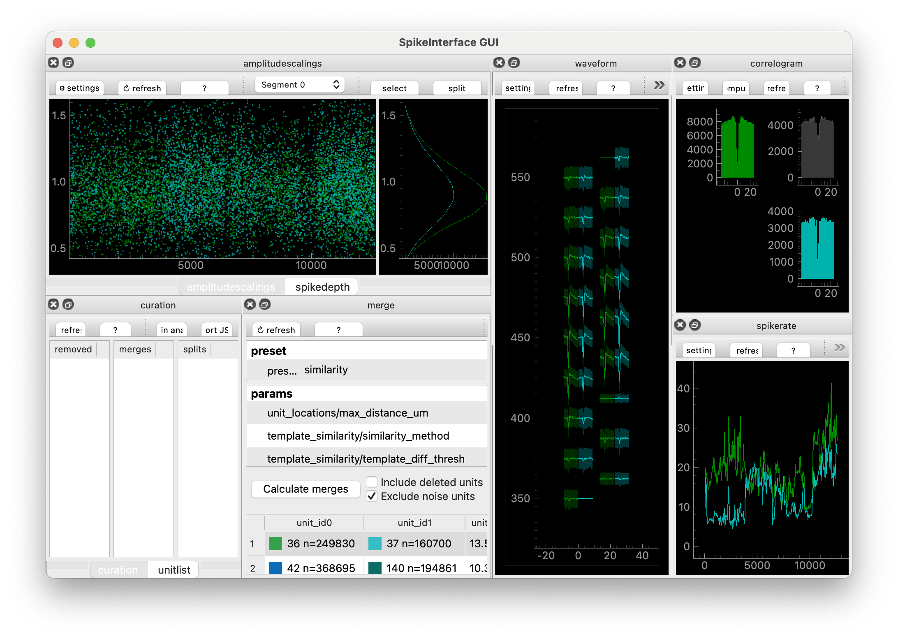

Once you've "accepted" the units you agree with, you can export a Curation file by clicking "Export json".

You can adjust the threshold for displaying potential merges, change the distance measurement, or completely change the method. Let's try the "slay" method, developed by Sai Koukuntla et. al. ([read more!](https://www.biorxiv.org/content/10.1101/2025.06.20.660590v1)).

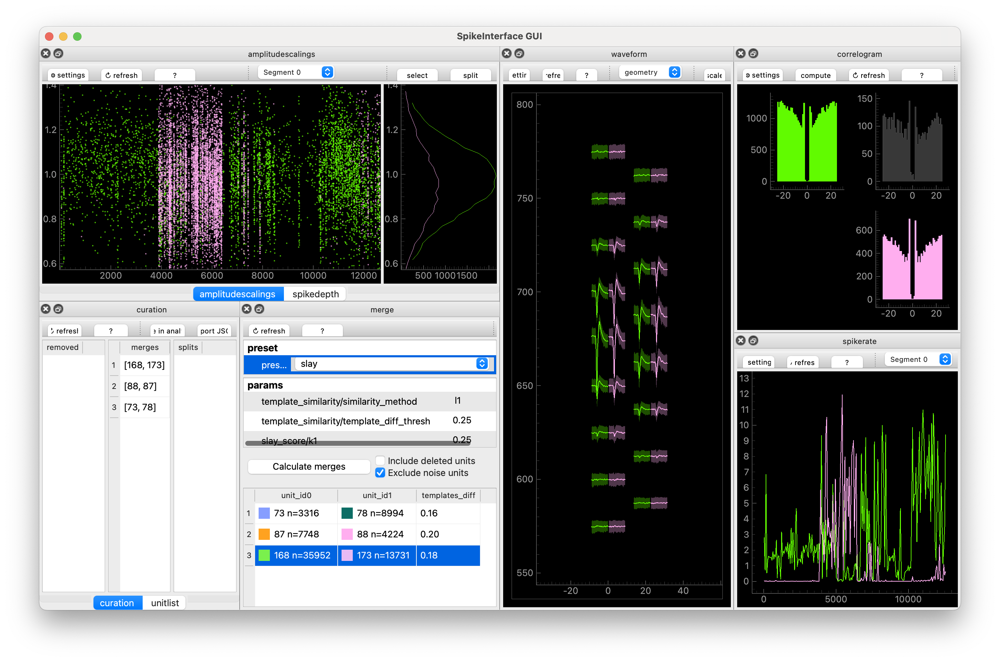

I find that everything SLAy suggests turns out to be a true merge, but it sometimes misses potential merges. Everything you see in the GUI, you can recreate in SpikeInterface using the `compute_merge_unit_groups` function:

```{python}
merge_unit_groups = si.compute_merge_unit_groups(
    sorting_analyzer,
    preset='slay',
)
print(merge_unit_groups)
```

Here are a two different workflows that you might try out.

  1. Using the GUI, find preset that gives you lots of potential merges. Manually go through these are "accept" the ones you agree with. 
  2. Using the GUI, adjust the parameters of your preset, and check the results. Keep adjusting the parameters until you agree with all decisions. Then using a Python script and SpikeInterface to automatically compute these merges and save them in a Curation.

I use 2., with SLAy.

## Splitting

Finally, SpikeInterface-GUI allows you to split units which have been over-merged. Splitting means taking a unit consisting of n spikes, and splitting the spikes into two groups. The two seperate groups are then each assigned to a new unit. You split one unit into two new units.

The current generation of spike sorters are usually tuned to over-split units because manual merging is relatively easy whereas manual splitting is difficult. Also, spikes which look like outliers in some way sometimes look like outliers for good reasons: these events might be when the spikes overlap with spikes from another unit. Or they could be slightly deformed spikes taking place during sharp wave ripples. Overall: I don't recommend splitting.

But if you insist, go into curation mode in the GUI and then you can select spikes in any of the "spikey" Views, and click "split"

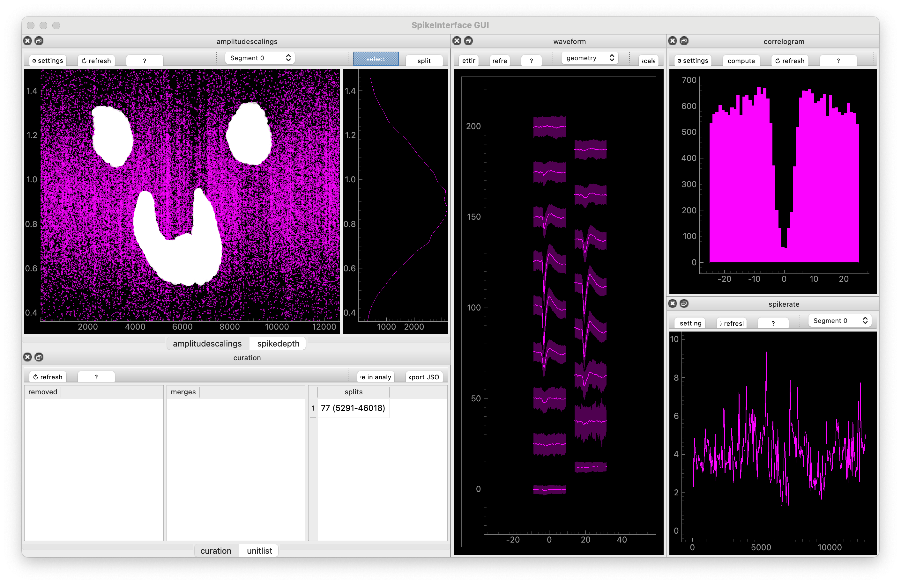

These decisions will be entered into "CurationView" and you can, again, export the **Curation** as a `json` file.

## "Functional" Curation philosophy

A quick philosophical break.

We've been implicitly using a "functional" curation approach. This means: don't edit the analyzer as you go. Instead, keep the original analyzer - treat it like raw data - then build a curation that you, at the last minute, can apply to it. When you apply it: make a new curated analyzer _and_ keep the original one. This is good for a few reasons:

  - **Data integrity**: you don't edit your original analyzer, which represents your spike sorting outputs
  - **Try different approaches**: you can try out different things. Keep one manual Curation file and one Curation file generated by an alogorithm, then switch between them and check if your downstream scientific results don't change.
  - **Change your mind**: if you change your mind about your curation, you don't need to redo your sorting, you just need to edit your curation.

When labelling, there isn't much different between our approach and just editing the analyzer, but you feel the difference more when you merge and split.

We can now update our mantra:

_Mantra of the day_: SpikeInterface-GUI is used to create a **Curation** file, _not_ to edit an analyzer.


## Make and apply a Curation

You've curated your data. Congrats!!! In the next section we'll do some downstream analysis. For downstream analysis, you might want to use curated results (i.e. only include the "good" units). To do this, we'll load the original analyzer, load the curation, and apply the curation to the analyzer:

```{python}
import spikeinterface.full as si

curation = si.load_curation("path/to/curation.json")
analyzer = si.load_sorting_analyzer("path/to/analyzer/")
curated_analyzer = si.apply_curation(analyzer)
```

This might take a little while: the analyzer has to recompute some extensions for the new units.

Depending on your requirements (see @tip-science), you might also delete "mua" units.

There are different things you could do at this stage: just save the spikes, or export to another format. For this workshop, we're going to export the results so that they can be used with [Pynapple](). You'll learn more about Pynapple later. For now, let's try to convert the curated analyzer to a Pynapple TsGroup:

```{python}
spikes = si.to_pynapple_tsgroup(curated_analyzer)
```

(Actually you're going to stream a sorting directly from DANDI. But if you were doing it from your own data, this is what you'd do.)

For me, this is the end of the spike sorting pipeline. You've investigated your ephys data, preprocessed it appropriately, sorted it, visualized the results, and curated them. Your data processing is over -- it's finally time to do some _neuroscience_!