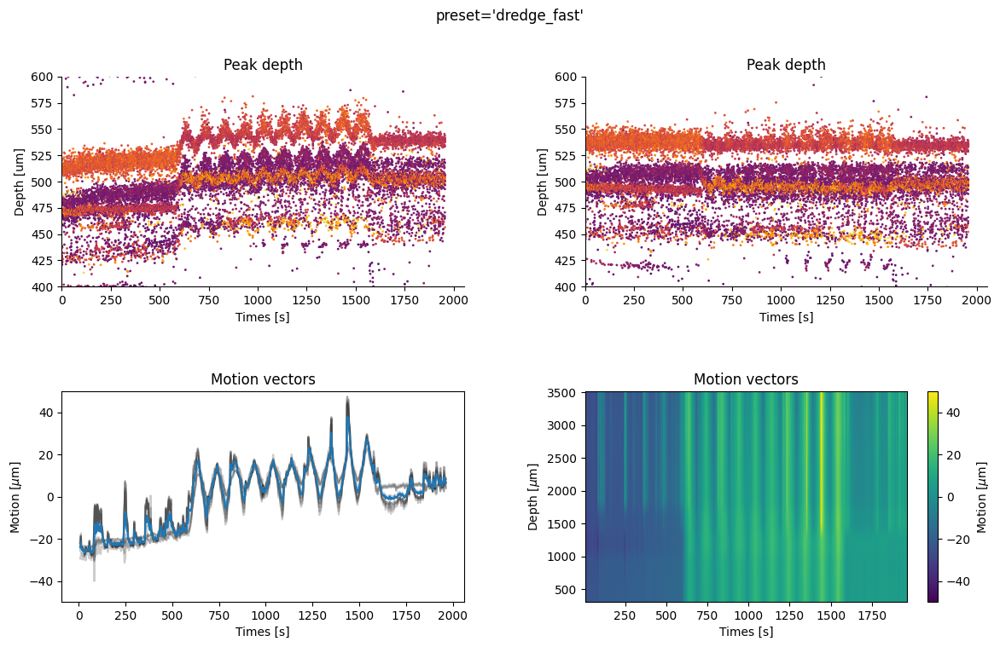
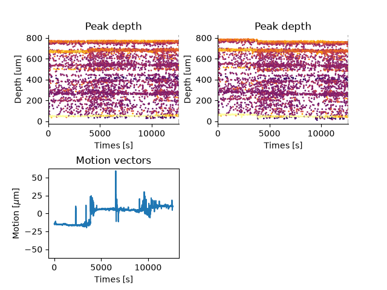
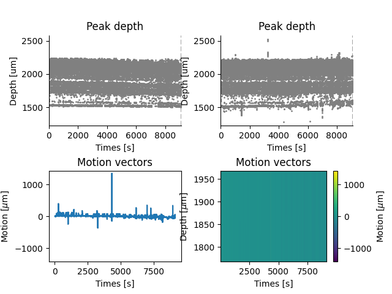
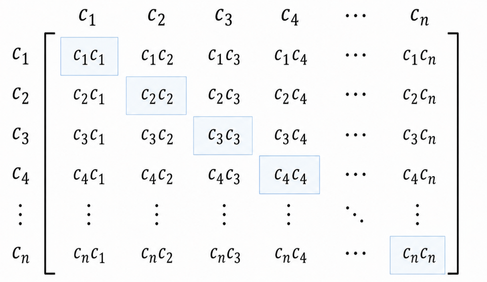
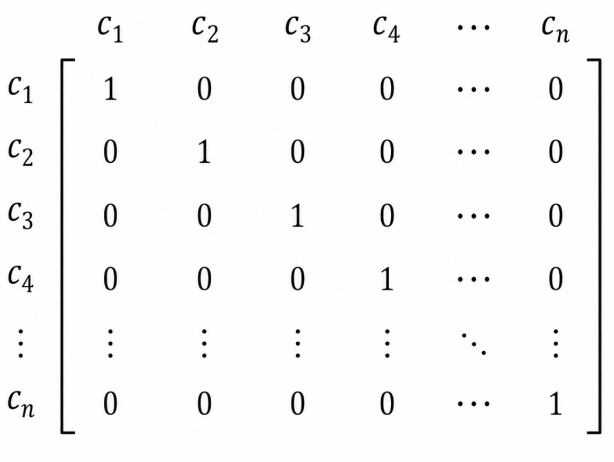

# Preprocessing (coding)

In this chapter we will explore in more detail the preprocessing steps used in extracellular electrophysiology. 

The purpose of preprocessing is to isolate as best possible our signal of interest (action potentials) from background noise. In electrophysiology the noise sources are typically electrical (e.g. broken recording electrodes) or mechanical (e.g. physical movement of the probe in the brain).

This chapter will focus on the practical implementation of preprocessing steps using SpikeInterface. 
See the [previous chapter](preprocessing-steps-presentation.qmd) for details on the underlying theory.

The preprocessing steps we will explore in this chapter are:

- **bandpass filtering**: Filters out low-frequency oscillations (e.g. 50-60 Hz noise) and high-frequency oscillations (e.g. noise spikes) from the data. Applied separately per channel.

- **bad channel detection** : Automatically detect channels that are dead, noisy or out-of-brain. These bad channels can be removed or interpolated (i.e 'filled in' using the data from surrounding channels).

- **common median referencing**: Removes noise that takes the form of stripes through the data (i.e. occurring on all channels for a short period of time). This is applied across all channels, separately per time point.

- **highpass spatial filter**: A destriping algorithm (i.e. similar to common median referencing) introduced by the [International Brain Laboratory (IBL)](https://figshare.com/articles/online_resource/Spike_sorting_pipeline_for_the_International_Brain_Laboratory/19705522?file=49783080) that accounts for slow oscillations of the signal across channels within the noise stripe.

- **motion correction** : A step to account for physical drift of the probe in the brain. Attempts to estimate the drift and interpolate the channels (having the effect of shifting the signal up or down the probe) to account for it.

- **whiten** : Removes correlated noise across channels and helps isolate spikes on  a subset of channels. Has significant effects on the data scaling and waveform shape.

::: {.callout-warning}

We are applying all of these preprocessing steps to explore their effects — **In general you would not apply all of these steps
to your recordings**. The preprocessing steps you choose will depend on your data, e.g. your recording device,
whether your implant is chronic or acute and the sorter you use.  We will discuss this throughout the chapter.

:::

## Set up

We will preprocess a new dataset recorded on a 64-channel Cambridge Neurotech probe. Note that we will not apply the `phase_shift` step that was used in [introduction preprocessing section](pipeline-overview.qmd#preprocessing), as that is only relevant for Neuropixel probes.


Before starting, we will import all required packages for the section:

```{python}

#| warning: false

from pathlib import Path

import numpy as np
import matplotlib.pyplot as plt
import spikeinterface.full as si

from course_ephys_osss.data.utils import download_and_slice_nwb_from_dandi
```


### Downloading the data


This is the first chapter in which we will use a core dataset used in this course,
a postsubiculum recording on a 64-channel Cambridge Neurotech probe used in an
experimental in neural tuning of head direction cells (see [here](course-data.qmd#head-direction-experiment-from-the-dandi-archive) for details).

We will download the first 90 seconds of a recording from this dataset from
the open access DANDI archive repository (an [excellent resource](course-data.qmd))

```{python}

## (optionally) change this to where you would like to download the data to.
RAW_DATA_FOLDER = Path("data/raw-dandiset-000939")

if RAW_DATA_FOLDER.exists():
    ## if we have already downloaded the data, reload it.
    recording = si.load(RAW_DATA_FOLDER)
else:
    ## Otherwise, download the first 90 seconds from DANDI
    download_and_slice_nwb_from_dandi(
        s3_url="https://dandiarchive.s3.amazonaws.com/blobs/a8f/800/a8f8003e-4483-4b50-8a45-91ac5971f5d5",
        duration_s=90,
        local_folder=RAW_DATA_FOLDER
    )
    recording = si.load(RAW_DATA_FOLDER)

```


Alternatively, the data can be downloaded directly from the 
[course data Zenodo](https://zenodo.org/records/21908611), with folder name `dandiset-000939-90s.zip` (will need unzipping before use).

### Creating a plotting function

Next, we will define a function to plot and compare multiple preprocessing steps. We will reuse this function through the rest of the tutorial.

```{python}

def plot_prepro(recordings, time_range, return_in_uV=True):
    """
    Plot multiple recordings in subplots.

    Parameters
    ----------
    recordings :
        A dictionary of recordings. The recordings will be plot and
        the corresponding keys used as plot titles.
    time_range: 
        A tuple with the (start, stop) times of the data to plot.
    """
    fig, axes = plt.subplots(
        1, len(recordings), 
        figsize=(6 * len(recordings), 5), 
        squeeze=False,
        layout="constrained",
    )

    ## Grab the first (and only) row of axes
    axes = axes[0, :]

    for idx, (name, recording) in enumerate(recordings.items()):
        
        ax = axes[idx]

        si.plot_traces(
            recording,
            time_range=time_range,
            mode="map",  ## plot as a heatmap
            ax=ax,
            with_colorbar=True,
            return_in_uV=True,
        )
        ax.set_title(name)
        ax.tick_params(axis="x", rotation=45)

```

## Bandpass filter

First, let's have a look at the effect of bandpass filtering the data, using the [`bandpass_filter()`](https://spikeinterface.readthedocs.io/en/latest/api.html#spikeinterface.preprocessing.bandpass_filter) function. We will plot the first second of the data:


```{python}

recording_bp = si.bandpass_filter(
    recording, 
    ## commonly used values to filter noise 
    ## while not affecting spikes
    freq_min=300, 
    freq_max=6000
) 

plot_prepro(
    {"raw": recording, "filtered": recording_bp}, 
    time_range=(0, 1)
)

```

The filtering operation removes a lot of contaminating low-frequency noise, realizing a significant improvement to the data.
Electrical noise at 50 or 60 Hz (i.e. oscillating 50 or 60 times per second) is common as mains power electricity oscillates
at those frequencies in many countries.

Bandpass filtering helps suppress this slow periodic component (although in practice good grounding and shielding are also
important for reducing mains noise at the source).

```{python}
#| echo: false

time = np.linspace(0, 0.2, 2000)
signal_50hz = np.sin(2 * np.pi * 50 * time)

fig, ax = plt.subplots(figsize=(8, 4), layout="constrained")
ax.plot(time, signal_50hz, color="k")
ax.set_title("Example 50 Hz signal")
ax.set_xlabel("time (s)")
ax.set_ylabel("amplitude")
plt.show()
```

Plotting a shorter time window demonstrates how this improves resolution of individual spikes:

```{python}

TIME_RANGE = (49, 49.02)

plot_prepro(
    {"raw": recording, "filtered": recording_bp}, 
    time_range=TIME_RANGE
)

```


## Bad Channel Detection

Individual recording electrodes on a probe sometimes break and become 'dead' (no signal), 'noisy' (excessive electrical noise)
or may be 'out of brain' (i.e. a contiguous set of channels at the end of the probe with no signal, indicating they are not in brain tissue). 
In our case, there is a small number of channels at the top of the previous plot whose traces look different than all the rest of
the signal. These are likely out of the brain.

The [IBL have developed an algorithm]((https://figshare.com/articles/online_resource/Spike_sorting_pipeline_for_the_International_Brain_Laboratory/19705522?file=49783080)) for automatically detecting bad channels, which has been ported to SpikeInterface.

First, let's use the [`detect_bad_channels()`](https://spikeinterface.readthedocs.io/en/latest/api.html#spikeinterface.preprocessing.detect_bad_channels) function on our data, printing a list of the channel label ("good", "outside", "dead", "noisy"), removing the bad channels and and visualizing the traces:

```{python}

bad_channel_ids_1, channel_labels_1 = si.detect_bad_channels(recording_bp)
print("first attempt labels:\n", channel_labels_1)

rec_clean_1 = recording_bp.remove_channels(bad_channel_ids_1)

plot_prepro(
    {"filtered": recording_bp, 
    "bad channels removed": rec_clean_1}, 
    TIME_RANGE
)
```

**It didn't work!** We can still see the dead channels on our recording. Why is this? 

The IBL algorithm was developed for Neurpixel probes (with 384 recording channels) but we are using Cambridge Neurotech 64-channel probes. 
As such, the default settings are not appropriate for our data, and we need to adjust them slightly. We reduce the threshold for
dead channel detection from `-0.5` to `-0.25` (this was done through manual trial and error):

```{python}
## Let's try again with different settings
bad_channel_ids, channel_labels = si.detect_bad_channels(
    recording_bp, dead_channel_threshold=-0.25
)
print("second attempt labels:\n", channel_labels)

rec_clean = recording_bp.remove_channels(bad_channel_ids)

plot_prepro(
    {"filtered": recording_bp, 
    "bad channels removed": rec_clean},
    TIME_RANGE
)

```

Now the dead channels, identifiable by visual inspection, are properly detected by the algorithm.

::: {.callout-warning}
This example demonstrates why it is critically important to **always visualize your data**
to ensure the default arguments of the algorithms we are using are suitable for the recording.
:::


## Common average referencing

Electrophysiological recordings are often contaminated by noise artefacts that appear on all channels at once for a short period of time.
Striping artefacts are typically caused by electrical noise that is shared across many recording channels, for example fluctuations in the reference electrode or electromagnetic interference.
These appear as vertical 'stripes' on the heatmap view of the data, as can be seen below.

Common average referencing (CAR) takes the average signal across all of the channels, and subtracts it. Sometimes you wil see this called 'common median referencing' (CMR) when the median is used instead of the mean. 

We can use SpikeInterface's [`common_reference()`](https://spikeinterface.readthedocs.io/en/latest/api.html#spikeinterface.preprocessing.common_reference) function to perform common median referencing: 

```{python}

recording_cmr = si.common_reference(
    rec_clean, 
    operator="median"
)

plot_prepro(
    {"filtered": rec_clean, 
    "recording_cmr": recording_cmr}, 
    TIME_RANGE
)

```

We can see that contaminating noise spikes that run vertically across the heatmap are removed through this processing method.

The implicit assumption of CAR or CMR is that the variability in the noise stripe is fairly small across channels (and so can be approximated well by removing only the central tendency measure). However, in practice this assumption is often broken, with stripes appearing only on a subset of channels (e.g. the top half). As such, the `common_reference` function contains a number of arguments allowing the operation to be performed on subsets of channels, and these can be explored in the 'things to try' section below.

As an alternative solution to the striping problem, the IBL introduced a 'highpass spatial filter' which captures slow variations in the noise stripes across channels:

```{python}

recording_hsf = si.highpass_spatial_filter(
    rec_clean, 
    highpass_butter_wn=0.03
)  

plot_prepro({"recording_cmr": recording_cmr, "recording_hsf": recording_hsf}, TIME_RANGE)

```

:::{.callout-tip}
#### Things to try

There's no need to get through all of these — pick whatever looks interesting.

- The time window we plot is important. Each spike is around 1-5 ms long, so if we plot long time windows we don't have enough pixels on the screen to resolve spikes. Nonetheless, longer windows can reveal other patterns in the data (e.g. 50 Hz noise). Play around with plotting different time windows (e.g. 10 ms, 200 ms, 1 s) to get a feel for this.
- Plot the data using the `mode="line"` argument. Same data — a completely different perspective!
- What happens if you set the bandpass filter minimum cutoff to zero? What frequencies are including now? Or set the maximum cutoff to 15000?
- Try common median referencing (CMR) particular subsets of channels, using the `reference`, `groups` arguments as well
as use different channels as reference using the `ref_channel_ids` argument. Recordings have a `get_channel_ids()` function that
returns a list of ids.
- Compute the Fourier transform of a data before and after bandpass filtering (using the `.get_traces()` function and [scipy's](https://scipy.org/) fourier transform functions) and plot the frequency spectrum.

:::

## Motion correction

The recording probe can move during an experiment. The major axis of movement is typically the direction along the probe's insertion path, as this offers less physical resistance than moving into the surrounding brain. Movement along this axis has the effect of shifting the recorded waveforms up or down the probe.

The majority of motion correction algorithms are based around the movement of detected spike waveforms. The pattern of detected spikes is used as a 'barcode' across time, allowing motion to be tracked through the recording (see this 
[infographic](https://spikeinterface.readthedocs.io/en/stable/_images/motion_correction_overview.png) for details - the grey dots in the plots are individual spikes which have been detected). Most motion correction algorithms have three main steps:

- **Spike detection and localization**: This step detections spikes in the data and estimates their physical location in space (x, y, z coordinates) from the waveform.

- **Motion estimation**: This estimates the probe movement based on how the detected spikes move up or down along the probe during the recording. Estimation may be `rigid` (capturing movement of the entire probe) or `non-rigid` (capturing movement that differs along the probe length, such as that caused by movement of brain tissue).

- **Interpolation**: Given the motion trace and recorded data, this interpolates the data (i.e. estimates the true data at a point given the collected data at surrounding points) back to what it would have been if there was no motion.

The key drift correction algorithms out there include
[Kilosort's](https://www.nature.com/articles/s41592-024-02232-7) drift correction (`kilosort-like` in SpikeInterface), 
[DREDge](https://www.nature.com/articles/s41592-025-02614-5) 
and 
[MEDiCINe](https://www.eneuro.org/content/12/3/ENEURO.0529-24.2025). 
SpikeInterface exposes these through the [`correct_motion()`](https://spikeinterface.readthedocs.io/en/latest/api.html#spikeinterface.preprocessing.correct_motion) function that uses convenient presets which define how spike detection, motion estimation and interpolation is run.

Today we will use `dredge_fast` and set `output_motion_info=True` so we can inspect the results of motion correction. 

Typically, non-rigid estimation algorithms break up the probe into sections and perform rigid alignment within each. Because this Cambridge Neurotech probe has only 64 channels, non-rigid estimation does not perform as well, and so we will turn it off (a full list of these arguments can be found [here](https://github.com/SpikeInterface/spikeinterface/blob/dbe2e7539ab63ebc0c3ddc856bfbc93f10e067aa/src/spikeinterface/preprocessing/motion.py#L18)):

```{python}

rec_corrected, motion_info = si.correct_motion(
    recording_cmr,
    preset="dredge_fast",
    output_motion_info=True,
    ## turn off non-rigid estimation
    estimate_motion_kwargs={"rigid": True},  
)
print(rec_corrected)

```


An [`InterpolateMotionRecording`](https://github.com/SpikeInterface/spikeinterface/blob/98170502207588f624a7dc88033ebf6f11a929cb/src/spikeinterface/sortingcomponents/motion/motion_interpolation.py#L274) is returned. This recording object applies motion correction to the requested chunk of data
based on the estimated motion.

Once motion correction is run, we can plot the outputs to inspect the results:

```{python}

## Display the motion output: drift map + estimated motion over depth/time.
fig = plt.figure(figsize=(14, 8))
si.plot_motion_info(
    motion_info,
    recording=rec_corrected,
    figure=fig,
    color_amplitude=True,
    amplitude_cmap="inferno",
    scatter_decimate=10,
)
fig.suptitle("Motion correction output")

```


In the top two plots, we see a spike raster plot before (left) and after (right) motion correction. Each dot indicates a spike, with its depth on the y-axis and recording time on the x-axis. 

The bottom left plot shows the estimated physical motion in μm over time.

Because this is only a 90-second recording, we see very little drift. On longer recordings, the drift and its correction will be more apparent, for example on these example recording with injected drift (from [this useful explainer](https://spikeinterface.readthedocs.io/en/stable/how_to/handle_drift.html#handle-drift-in-your-recording)):

::: {#fig-dredge fig-align="center"}
{width=100%}

Example DREDGE drift-correction on a longer recording with injected drift.
:::

In our case, if we compute the drift across the entire recording we get the below plot:

::: {#fig-full-data fig-align="center"}
{width=100%}
:::

We see that there is little drift in the recording, and that motion correction has
in fact introduced an artefact around the 4000 second mark visible in the top-right plot.

This highlights an important point: if the drift plots for your
recordings indicate little drift, you may want to consider turning off motion correction.
This is because the interpolation step will be performed based on small, but non-zero
estimated motion and can add noise to the recording.

Similarly, erroneous motion correction can result in a vertical 'smearing' of spikes in the raster plot.
This is especially true for low-channel count probes or probes with low firing rate neurons
(see [here](https://github.com/SpikeInterface/spikeinterface/issues/4432) for a discussion on the phenomenon) e.g:

::: {#fig-kilosort-like fig-align="center"}
{width=100%}

Erroneous motion estimation from the `kilosort_like` preset on a low-channel-count probe. A large error, around 4700 seconds, can be seen in the motion vector which 'smears' the estimated peak locations in the corrected raster plot (top right).
:::

The takeaway from this section is to always plot your estimation motion (even if you don't eventually apply motion correction),
using it to make the decision whether to apply this to your sorted data or not. You can check drift maps in SpikeInterface,
through Kilosort outputs or using the interactive [driftplots](https://github.com/neuroinformatics-unit/driftplots) package.

## Whitening

Finally, we will explore the whitening step. The whitening step reduces noise correlated across channels, and can help localize spikes onto a smaller number of channels. 

Whitening is quite an aggressive preprocessing step, significantly rescaling the data and changing spike waveforms, and is sensitive to how the covariance between channels is estimated.

In SpikeInterface, whitening is done by the [`whiten()`](https://spikeinterface.readthedocs.io/en/latest/api.html#spikeinterface.preprocessing.whiten) function:

```{python}

recording_whiten = si.whiten(rec_corrected)

plot_prepro(
    {"rec_corrected": rec_corrected, 
    "whitened": recording_whiten}, 
    TIME_RANGE,
)

```


This is all we need to do to get a whitened version of our recording, however due the scaling that whitening performs it is difficult to see what has happened. 

To get a better understanding of how whitening changes the data, let's rescale the whitened data back to its original scaling (roughly) for visualization purposes. **Note we would not ever do this for recordings used in downstream analysis, this is just for visualization purposes**.

::: {.callout-note collapse="true"}
#### How the rescaling works.

The correlation matrix is the key structure of the whitening step. It is computed by correlating all channels with each other:

::: {#fig-kilosort-like fig-align="center"}
{width=100%}
:::

Here $c_i$ represents a channel's data indexed by some integer $i$. $c_ic_j$ represents the sum of squares of the data from channels $i$ and $j$ (i.e. multiple each value in the vector with the corresponding value and add these all together). For example $c_1c_1$ is the variance for channel $c_1$, and $c_1c_2$ represents the covariance between channels 1 and 2. 

For those interested, you can see how this comes from the [covariance definition](https://www.educba.com/covariance-formula/) when the mean of the channel data is zero and we ignore the scaling factor $N$.

The goal of the whitening step is to remove all cross-channel correlation from the data. As we can see from the above matrix, this equates to setting all the off-diagonal entries to zero. In fact it goes a little further, setting the variance of each channel to `1` as well (making the covariance matrix the 'identity' matrix):

::: {#fig-kilosort-like fig-align="center"}
{width=100%}
:::

Rescaling the variances is why this step has such a large effect on the data scaling.

We can estimate the original channel scaling by multiplying the data by the average standard deviation (i.e. noise) of the data.
When we compute the covariance matrix of the scaled data, we should see this approximation of the original channel
variances along the diagonal, instead of ones (with zeros still on the off-diagonals, at least in theory).

:::

```{python}

noise = np.mean(
    si.get_noise_levels(
        rec_corrected, return_in_uV=False, method="std"
    )
)

scaled_white_recording = si.scale(recording_whiten, noise)

plot_prepro(
    {"rec_corrected": rec_corrected, 
    "scaled_white_recording": scaled_white_recording}, 
    TIME_RANGE
)

```

We can zoom in on some spikes, to really see how the waveforms are changed (below, we extract the raw data and slice it to visualize some representative spikes that display the phenomenon clearly):

```{python}

## Select the times we want to display and convert them into samples
start_frame = int(TIME_RANGE[0] * rec_corrected.get_sampling_frequency())
end_frame = int(TIME_RANGE[1] * rec_corrected.get_sampling_frequency())

## Get the data from this time range, and further slice it around a few spikes
orig_data = rec_corrected.get_traces(
    start_frame=start_frame, end_frame=end_frame, return_in_uV=True
)[200:400, :4]

whitened_data = scaled_white_recording.get_traces(
    start_frame=start_frame, end_frame=end_frame, return_in_uV=True,
)[200:400, :4]

## Plot the spikes, adding an offset between traces so they 
## are displayed vertically stacked.
plt.figure(figsize=(8, 5))
plt.plot(orig_data + np.arange(orig_data.shape[1]) * 750, color="k")
plt.plot(whitened_data + np.arange(whitened_data.shape[1]) * 750, color="r")
plt.xlabel("sample number")
plt.show()

```

Here, we can see that spikes are 'squashed' onto a smaller number of channels (which can aid spike sorting). The second spike is now only found on 4 channels instead of 3. The 1st and 3rd spikes, which was probably a single waveform distributed over 4 channels, however now appear to be split into only two separate spikes.


## Saving the data

SpikeInterface makes it very easy to save preprocessed data, which is useful as applying 
preprocessing to an entire long recording can take some time. Here we will save the data
preprocessed with *bandpass filter*, *bad channel removal* and *common referencing* for use
later in the course. 

In general, we can perform these lighter preprocessing steps in SpikeInterface
and let the sorter use internaly preprocessing for oher steps.

```{python}

PREPROCESSED_DATA_FOLDER = Path("data/preprocessed-dandiset-000939")

if not PREPROCESSED_DATA_FOLDER.exists():
    recording_cmr.save(folder=PREPROCESSED_DATA_FOLDER)

```


## How to turn off the steps in KS 

Finally, when we sort our preprocessed data we must remember to turn off the relevant steps in Kilosort so we do not apply them twice! (for filtering, it is not possible to fully turn it off
so we set the cutoff to a very low value so that the step does little to the data).

For Kilosort this is an example to make this point clear. In practice, most people who run Kilosort use Kilosort's own whitening and motion correction.

::: {.callout-warning}

Take care when turning off preprocessing steps that a sorter applies. For example, Kilosort
runs whitening prior to motion correction, while in SpikeInterface it is recommended to perform
motion correction first. There may be subtle differences in how these steps are applied, and
sorters may make assumptions internally that the data will be preprocessed in a certain way. 

Typically it is safe to perform filtering and common referencing in SpikeInterface. When overwriting more agressive preprocessing steps (e.g. motion correction, whitening), it is worth checking the sorting outputs are improved compared to the sorters own defaults.

:::

```{python}
#| eval: false
import spikeinterface.sorters as si_sorters

sorting = si_sorters.run_sorter(
    "kilosort4",
    recording_whiten,
    folder="_tmp/ks4_out",
    remove_existing_folder=True,
    verbose=True,
    skip_kilosort_preprocessing=True,  ## turn off whitening and other steps
    do_CAR=False,  ## turn off CAR and filtering to be sure
    highpass_cutoff=0.01,
    do_correction=False,  ## turn off motion correction
)
print(sorting)

```