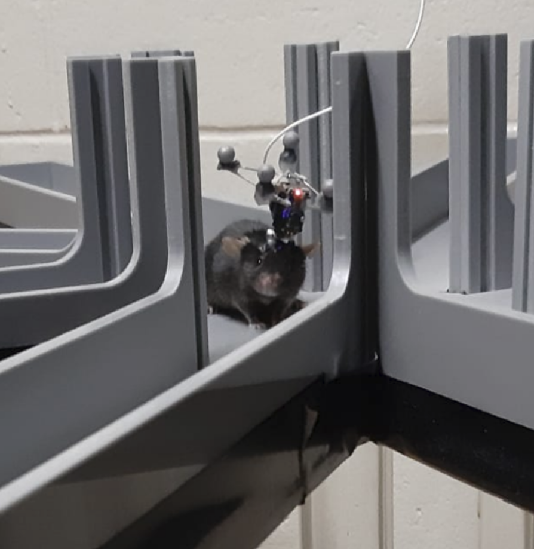

# Neural analysis with Pynapple {.unnumbered}

This chapter is an introduction to [Pynapple](pynapple.org).  
Pynapple is a python package for analysing neural data.  
The package is actively maintained by the Flatiron Institute's [neuroRSE team](https://neurorse.flatironinstitute.org/). 

Pynapple can do a lot more than what is covered in this chapter, take a look at the [Pynapple documentation](https://pynapple.org/user_guide/03_core_methods.html) for more.   
The only thing you'll need to follow along is a working Python environment with `pynapple` installed.
<span style="color:red">LINK TO PREVIOUS CHAPTERS</span>.

Open your favourite way of running Python, and follow along!

## Origins

- __2000:  TSToolbox, MATLAB__  
McNaughton lab: David Redish & Francesco Battaglia  

- __2016:  TSToolbox2, MATLAB__  
Adrien Peyrache & Luke Sjulson  

- __2018:  neuroseries,  Python__  
Francesco Battaglia  

- __2021:  pynapple, Python__  
Guillaume Viejo  

presently with the Flatiron Institute's neuroRSE team:

- __Guillaume Viejo__
- __Sarah Jo Venditto__
- Edoardo Balzani
- William Broderick

+ __Wolf De Wulf__, a 2025 neuroRSE intern


## Goal
Pynapple was designed to lie in between pre- and postprocessing.  
It contains functions facilitating alignment, wrangling, and performing basic neuroscientific analysis.

<div class="timeline-horizontal">
<div class="timeline-entries-horizontal">
<div class="timeline-entry">
  <b>Recording</b><br>
  
</div>

<div class="timeline-entry">
  <b>Processing</b><br>
  segmenting (`calman`)<br>
  spike-sorting (`spikeinterface`)
</div>
<div class="timeline-entry logo">
  
</div>
<div class="timeline-entry">
  <b>Analysis</b><br>
  model fitting (`nemos`)<br>
  interpretation (`you`)
</div>
</div>
<div class="timeline-arrow"></div>
</div>
<style>
.timeline-horizontal {
  height: 20vh;
  display: flex;
  flex-direction: column;
  justify-content: center;
}
.timeline-arrow {
  position: relative;
  width: 90%;
  height: 6px;
  background: currentColor;
  margin: 1em auto 0;
}
.timeline-arrow::after {
  content: "";
  position: absolute;
  right: -6px;
  top: -9px;
  border-top: 12px solid transparent;
  border-bottom: 12px solid transparent;
  border-left: 18px solid currentColor;
}
.timeline-entries-horizontal {
  display: grid;
  grid-template-columns: 1fr 1fr 0.5fr 1fr;
  align-items: center;
  width: 90%;
  margin: 0 auto 1em;
}
.timeline-entry {
  text-align: center;
  font-size: 1.1em;
}
.logo {
  margin: 0 1em;
}
</style>

## 1. Pynapple fundamentals

### Time series (`Ts`)
We store a time series, for example a spike train, in a `Ts` object.
```{python}

import pynapple as nap
ts = nap.Ts(t=[1,2,3,4,5])
ts
```
```{python}
#| code-fold: true
#| code-summary: "Show plotting code"

import matplotlib.pyplot as plt
fig, ax = plt.subplots(constrained_layout=True, figsize=(5,3))
for timepoint in ts.times():
    ax.axvline(timepoint)
ax.yaxis.set_visible(False)
ax.spines['left'].set_visible(False)
ax.spines['right'].set_visible(False)
ax.spines['top'].set_visible(False)
ax.set_xlabel("time (s)")
plt.show()
```

### Time series with data (`Tsd`)
We store a time series with corresponding data values, for example the speed of a mouse when it is running around, in a `Tsd` object.

```{python}
import pynapple as nap
import numpy as np
tsd = nap.Tsd(t=[1,2,3,4,5], d=[1,1,1,2,1])
tsd
```
```{python}
#| code-fold: true
#| code-summary: "Show plotting code"

import matplotlib.pyplot as plt
fig, ax = plt.subplots(constrained_layout=True, figsize=(5,3))
ax.plot(tsd)
ax.spines['top'].set_visible(False)
ax.spines['right'].set_visible(False)
ax.set_xlabel("time (s)")
ax.set_ylabel("data (a.u.)")
plt.show()
```

### Multiple time series
If we have multiple time series, they can be collected in a `TsGroup`.  
This could be a collection of spike times for multiple spiking units, for example.
```{python}
import pynapple as nap
tsgroup = nap.TsGroup({
    1: nap.Ts([1,2,3,4,5]), 
    2: nap.Ts([1.5, 2.2, 2.9, 4.2])
})
tsgroup
```
```{python}
#| code-fold: true
#| code-summary: "Show plotting code"

import matplotlib.pyplot as plt
import numpy as np
cmap = plt.get_cmap("tab10")
fig, ax = plt.subplots(constrained_layout=True, figsize=(5,3))
for i in tsgroup:
    ax.vlines(tsgroup[i].times(), i, i+1, label=i, color=cmap(i-1))
ax.yaxis.set_visible(False)
ax.spines['left'].set_visible(False)
ax.spines['right'].set_visible(False)
ax.spines['top'].set_visible(False)
ax.set_xlabel("time (s)")
plt.ylim(1,3)
plt.legend(frameon=False)
plt.show()
```

### Time series with multiple data columns (`TsdFrame`)
If we have a time series with multiple data associated with the same time points, they can be stored in a `TsdFrame`.  
This could be a collection of activity traces from multiple cells, e.g. recorded using [calcium-imaging](https://www.sciencedirect.com/science/article/pii/S0896627312001729).
```{python}
import pynapple as nap
tsdframe = nap.TsdFrame(
    t=[1,2,3,4,5], 
    d=[[1,2],
       [1,2],
       [1,3],
       [2,1],
       [1,2]],
    columns=["A", "B"]
)
tsdframe
```
```{python}
#| code-fold: true
#| code-summary: "Show plotting code"
import matplotlib.pyplot as plt
import numpy as np
fig, ax = plt.subplots(constrained_layout=True, figsize=(5,3))
for i, col in enumerate(tsdframe.columns):
    ax.plot(tsdframe[:, i], label=col)
ax.set_ylabel("data (a.u.)")
ax.set_xlabel("time (s)")
ax.spines['top'].set_visible(False)
ax.spines['right'].set_visible(False)
plt.legend(frameon=False)
plt.show()
```

### Intervals (`IntervalSet`)
Often we want to store events that occur across a period rather than at single time points,
for example a behavioural stimulus that lasts multiple seconds, or a period of sleep.
To represent this, we store time intervals as start and end pairs in an `IntervalSet`.
```{python}
import pynapple as nap
epochs = nap.IntervalSet(
    start=[1, 3, 7],
    end=[2, 5, 9]
)
epochs
```
```{python}
#| code-fold: true
#| code-summary: "Show plotting code"

import matplotlib.pyplot as plt
fig, ax = plt.subplots(constrained_layout=True, figsize=(5,3))
for start, stop in epochs.values:
    ax.axvspan(start, stop)
ax.set_xlabel("time (s)")
ax.spines['left'].set_visible(False)
ax.spines['right'].set_visible(False)
ax.spines['top'].set_visible(False)
plt.show()
```

## 2. Interactions
A key goal of Pynapple is to facilitate integrating neural activity and behavioural data 
for processing and analysis. Therefore, many Pynapple objects interact with each other.

### Time supports (`time_support`)
Every time series object has a time support, an `IntervalSet` that gives the epochs
over which the time series is defined.
```{python}
import pynapple as nap
ts = nap.Ts(t=[1,2,3,4,5])
ts.time_support
```
```{python}
#| code-fold: true
#| code-summary: "Show plotting code"
import matplotlib.pyplot as plt
fig, ax = plt.subplots(constrained_layout=True, figsize=(5,3))
for timepoint in ts.times():
    ax.axvline(timepoint)
for start, stop in ts.time_support.values:
    ax.axvspan(start, stop, alpha=0.2)
ax.yaxis.set_visible(False)
ax.spines['left'].set_visible(False)
ax.spines['right'].set_visible(False)
ax.spines['top'].set_visible(False)
ax.set_xlabel("time (s)")
plt.show()
```

### Restricting (`restrict`)
Any time series object can be restricted to certain `IntervalSet`, thereby updating its time support.
This could be used, for example, to keep only the spike times that fall within the presentation of a behavioural stimulus.
```{python}
import pynapple as nap
ts = nap.Ts(t=[1,2,3,4,5])
restriction = nap.IntervalSet(start=[1.3, 3.9], end=[3.5, 4.2])
restricted = ts.restrict(restriction)
restricted
```
```{python}
#| code-fold: true
#| code-summary: "Show plotting code"
import matplotlib.pyplot as plt
fig, ax = plt.subplots(constrained_layout=True, figsize=(5,3))
for timepoint in restricted.times():
    ax.axvline(timepoint)
for start, stop in restricted.time_support.values:
    ax.axvspan(start, stop, alpha=0.2)
ax.yaxis.set_visible(False)
ax.spines['left'].set_visible(False)
ax.spines['right'].set_visible(False)
ax.spines['top'].set_visible(False)
ax.set_xlabel("time (s)")
ax.set_xlim(1,5)
plt.show()
```

### Taking values (`value_from`)
Given one time series, you can `value_from` to take the value corresponding 
to the closest time point in another time series with data.
This can be handy, for example, if you want to sample the position of an animal, at particular spike times.
```{python}
import pynapple as nap
import numpy as np
ts = nap.Ts(t=[1,2,3,4,5])
tsd = nap.Tsd(t=np.arange(0, 10, 0.1), d=np.random.randn(100))
values = ts.value_from(tsd)
values
```
```{python}
#| code-fold: true
#| code-summary: "Show plotting code"
import matplotlib.pyplot as plt
fig, ax = plt.subplots(constrained_layout=True, figsize=(5,3))
ax.plot(tsd, label="tsd")
ax.plot(values, label="values", linestyle="none", marker=".")
minimum = tsd.values.min()
cmap = plt.get_cmap("tab10")
for timepoint, value in zip(values.times(), values.values, strict=True):
    ax.vlines(timepoint, ymin=minimum, ymax=value, color=cmap(1))
ax.set_ylabel("data (a.u.)")
ax.set_xlabel("time (s)")
ax.spines['right'].set_visible(False)
ax.spines['top'].set_visible(False)
fig.legend(frameon=False, bbox_to_anchor=(1.0, 1.1))
plt.show()
```

## 3. Wrangling
Pynapple objects are easy to transform, reshape, slice, and more.

### Numpy
Most Numpy functions can be applied to Pynapple objects without hassle.
```{python}
import pynapple as nap
import numpy as np
tsdframe = nap.TsdFrame(
    t=[1,2,3,4,5], 
    d=[[1,2],
       [1,2],
       [1,3],
       [2,1],
       [1,2]],
    columns=["A", "B"]
)
np.mean(tsdframe, axis=1)
```
```{python}

import pynapple as nap
import numpy as np
tsdframe = nap.TsdFrame(
    t=[1,2,3,4,5], 
    d=[[1,2],
       [1,2],
       [1,3],
       [2,1],
       [1,2]],
    columns=["A", "B"]
)
np.diff(tsdframe, axis=1)
```

### Slicing
Pynapple objects can be sliced like Numpy arrays.
```{python}
import pynapple as nap
import numpy as np
tsdframe = nap.TsdFrame(
    t=[1,2,3,4,5], 
    d=[[1,2],
       [1,2],
       [1,3],
       [2,1],
       [1,2]],
    columns=["A", "B"]
)
tsdframe[:, 1]
```
```{python}

import pynapple as nap
import numpy as np
tsdframe = nap.TsdFrame(
    t=[1,2,3,4,5], 
    d=[[1,2],
       [1,2],
       [1,3],
       [2,1],
       [1,2]],
    columns=["A", "B"]
)
tsdframe[2:4]
```

## 4. Core functions
Pynapple has a core set of functions designed to help with neuroscientific analysis.
The following are a subset of them, for an exhaustive list, see the [Pynapple documentation](https://pynapple.org/user_guide/03_core_methods.html).

### Binning
The time points of any time series object can be counted.
```{python}
import pynapple as nap
import numpy as np
time_step_s = 0.001
times = np.arange(0, 4, time_step_s)

# Create a firing pattern that increases and decreases as a sine wave
rate = 40 * (1 + np.sin(2*np.pi*times)) / 2

# Use the rate to create discrete spike times
spikes = nap.Ts(times[np.random.rand(len(times)) < rate * time_step_s])

# Bin the spike times
counts = spikes.count(bin_size=0.1)
counts
```
```{python}
#| code-fold: true
#| code-summary: "Show plotting code"

import matplotlib.pyplot as plt
fig, (ax_rate, ax_spikes, ax_count) = plt.subplots(
    3, 1, constrained_layout=True, figsize=(7.5,3), sharex=True
)
ax_rate.plot(times, rate)
ax_rate.spines['right'].set_visible(False)
ax_rate.spines['top'].set_visible(False)
ax_rate.set_ylabel("true rate [Hz]")
ax_spikes.vlines(spikes.times(), 0, 1)
ax_spikes.set_ylabel("spikes")
ax_spikes.set_yticks([])
ax_spikes.spines['left'].set_visible(False)
ax_spikes.spines['right'].set_visible(False)
ax_spikes.spines['top'].set_visible(False)
ax_count.plot(counts)
ax_count.set_ylabel("count")
ax_count.set_xlabel("time (s)")
ax_count.spines['right'].set_visible(False)
ax_count.spines['top'].set_visible(False)
plt.show()
```

### Averaging
If you have continous data already, you would not count events in bins, but rather average values across bins.
For example, if you wanted to downsample a signal without losing too much information.
```{python}
import pynapple as nap
import numpy as np
time_step_s = 0.01
times = np.arange(0, 10, time_step_s)

# Create a sine wave signal
signal = np.sin(2 * np.pi * times) 

# Add random noise
signal += 0.2 * np.random.randn(len(times))

# Store as Tsd
tsd = nap.Tsd(t=times, d=signal)

# Average across 200ms bins
averaged = tsd.bin_average(bin_size=0.2)
averaged
```
```{python}
#| code-fold: true
#| code-summary: "Show plotting code"

import matplotlib.pyplot as plt
fig, ax = plt.subplots(constrained_layout=True, figsize=(5,3))
plt.plot(tsd, label="original")
plt.plot(averaged, label="averaged")
ax.set_ylabel("data (a.u.)")
ax.set_xlabel("time (s)")
ax.spines['right'].set_visible(False)
ax.spines['top'].set_visible(False)
fig.legend(frameon=False, bbox_to_anchor=(1.0, 1.1))
plt.show()
```

### Thresholding
Time series with data can be thresholded, yielding new time series objects with updated time supports.
```{python}
import pynapple as nap
import numpy as np
time_step_s = 0.01
times = np.arange(0, 10, time_step_s)

# Create a sine wave signal
signal = np.sin(2 * np.pi * times) 

# Add random noise
signal += 0.2 * np.random.randn(len(times))

# Store as Tsd
tsd = nap.Tsd(t=times, d=signal)

# Threshold
above = tsd.threshold(0.5, method="above")
below = tsd.threshold(-.5, method="below")
above.time_support
```
```{python}
#| code-fold: true
#| code-summary: "Show plotting code"

import matplotlib.pyplot as plt
fig, ax = plt.subplots(constrained_layout=True, figsize=(5,3))
ax.plot(tsd, label="original")
ax.plot(above, label="above", marker=".", linestyle="none")
ax.plot(below, label="below", marker=".", linestyle="none")
ax.spines['right'].set_visible(False)
ax.spines['top'].set_visible(False)
fig.legend(frameon=False, bbox_to_anchor=(1.0, 1.2))
plt.show()
```

### Smoothing
Time series with data can be smoothed.
Smoothing makes a signal less noisy by averaging out small, fast changes while keeping the main pattern.
The operation consists of convolving the signal with a Gaussian kernel.
```{python}
import pynapple as nap
import numpy as np
time_step_s = 0.01
times = np.arange(0, 10, time_step_s)

# Create a sine wave signal
signal = np.sin(2 * np.pi * times) 

# Add random noise
signal += 0.2 * np.random.randn(len(times))

# Store as Tsd
tsd = nap.Tsd(t=times, d=signal)

# Gaussian smooth with a standard deviation of 100ms
smoothed = tsd.smooth(std=0.1)
smoothed
```
```{python}
#| code-fold: true
#| code-summary: "Show plotting code"

import matplotlib.pyplot as plt
fig, ax = plt.subplots(constrained_layout=True, figsize=(5,3))
ax.plot(tsd, label="original")
ax.plot(smoothed, label="smoothed")
ax.set_ylabel("data (a.u.)")
ax.set_xlabel("time (s)")
ax.spines['right'].set_visible(False)
ax.spines['top'].set_visible(False)
fig.legend(frameon=False, bbox_to_anchor=(1.0, 1.1))
plt.show()
```

## 5. Advanced Functions
Beyond fundamental processing functions, Pynapple has loads of advanced functionality for neuroscientific analysis.

### Autocorrelograms
Given one or a group of time series, you can compute autocorrelograms.  
<span style="color:red">LINK TO PREVIOUS CHAPTERS</span>.

```{python}
import pynapple as nap
import numpy as np
time_step_s = 0.01
times = np.arange(0, 4, time_step_s)

# Create a firing pattern that increases and decreases as a sine wave
rate = 40 * (1 + np.sin(2*np.pi*times)) / 2

# Use the rate to create 2 spiking units, one with double the rate
units = nap.TsGroup({
    1: nap.Ts(times[np.random.rand(len(times)) < rate * time_step_s]),
    2: nap.Ts(times[np.random.rand(len(times)) < rate*2 * time_step_s]),
})

# Compute autocorrelograms
autocorrelogram = nap.compute_autocorrelogram(
    units, binsize=0.1, windowsize=1.0, norm=False
)
autocorrelogram
```
```{python}
#| code-fold: true
#| code-summary: "Show plotting code"

import matplotlib.pyplot as plt
ax=autocorrelogram.plot()
plt.ylabel("rate (Hz)")
plt.xlabel("time (s)")
ax.spines['right'].set_visible(False)
ax.spines['top'].set_visible(False)
plt.legend(frameon=False)
plt.show()
```
### Crosscorrelograms
Given one or two groups of time series, you can also compute crosscorrelograms.
```{python}
crosscorrelogram = nap.compute_crosscorrelogram(
    units, binsize=0.1, windowsize=1.0, norm=False
)
crosscorrelogram
```
```{python}
#| code-fold: true
#| code-summary: "Show plotting code"
import matplotlib.pyplot as plt
ax=crosscorrelogram.plot()
plt.ylabel("rate (Hz)")
plt.xlabel("time (s)")
ax.spines['right'].set_visible(False)
ax.spines['top'].set_visible(False)
plt.legend(frameon=False)
plt.show()
```

### Signal processing
Pynapple wraps a lot of scipy functions for signal processing.

Let's simulate a noisy multi-frequency signal (the combination of multiple sine waves oscillating at different frequencies):
```{python}
import pynapple as nap
import numpy as np
sampling_rate_hz = 1000
times = np.linspace(0, 2, sampling_rate_hz * 2)

# Signals at different frequencies
signal_2Hz = np.cos(times*2*np.pi*2)
signal_10Hz = np.cos(times*2*np.pi*10)
signal_50Hz = np.cos(times*2*np.pi*50)

# Combine
signal = signal_2Hz+signal_10Hz+signal_50Hz

# Add noise
signal += np.random.normal(0, 0.5, len(times))

# Store in Tsd
tsd = nap.Tsd(t=times,d=signal)
tsd
```
```{python}
#| code-fold: true
#| code-summary: "Show plotting code"
import matplotlib.pyplot as plt
fig, (ax2, ax10, ax50, ax) = plt.subplots(
    4,
    1,
    constrained_layout=True, 
    figsize=(5,6), 
    sharex=True
)
ax.plot(tsd)
ax2.plot(times,signal_2Hz, color="red")
ax2.spines['right'].set_visible(False)
ax2.spines['top'].set_visible(False)
ax2.set_ylabel("2Hz")
ax10.plot(times,signal_10Hz, color="red")
ax10.spines['right'].set_visible(False)
ax10.spines['top'].set_visible(False)
ax10.set_ylabel("10Hz")
ax50.plot(times,signal_50Hz, color="red")
ax50.spines['right'].set_visible(False)
ax50.spines['top'].set_visible(False)
ax50.set_ylabel("10Hz")
ax.set_ylabel("mixed signal (a.u.)")
ax.set_xlabel("time (s)")
ax.spines['right'].set_visible(False)
ax.spines['top'].set_visible(False)
plt.show()
```

#### Bandpass filter
We can bandpass filter to extract certain frequency bands.
For example, if we apply a bandpass filter with a 8Hz high-pass and 12Hz low-pass cutoff,
we will keep only the part of the signal in the 8-12hz range.
```{python}
filtered = nap.apply_bandpass_filter(
    data=tsd, 
    cutoff=(8, 12), 
    fs=sampling_rate_hz, 
    mode='butter'
)
filtered
```
```{python}
#| code-fold: true
#| code-summary: "Show plotting code"
import matplotlib.pyplot as plt
fig, (ax_original, ax_filtered) = plt.subplots(
    2,
    1,
    constrained_layout=True, 
    figsize=(5,4), 
    sharex=True
)
ax_original.plot(tsd, color="red")
ax_original.set_ylabel("original (a.u.)")
ax_original.spines['right'].set_visible(False)
ax_original.spines['top'].set_visible(False)
ax_filtered.plot(filtered)
ax_filtered.set_xlabel("time (s)")
ax_filtered.set_ylabel("filtered (a.u.)")
ax_filtered.spines['right'].set_visible(False)
ax_filtered.spines['top'].set_visible(False)
plt.show()
```

#### Power-spectral density
We can compute the [power-spectral density (PSD)](The power spectral density (PSD) shows how strongly different frequencies contribute to a signal. It is only shown up to half the sampling rate (the Nyquist frequency), because higher frequencies cannot be reliably recovered from the recorded data. See the SciPy periodogram documentation for more details: https://docs.scipy.org/doc/scipy/reference/generated/scipy.signal.periodogram.html.) to find frequencies of interest.  
The PSD shows how strongly different frequencies contribute to a signal. 
You only ever compute it up to half the sampling rate (the Nyquist frequency), 
because higher frequencies cannot be reliably recovered from the recorded data. 
```{python}
psd = nap.compute_power_spectral_density(
    tsd, 
    fs=sampling_rate_hz
)
psd
```
```{python}
#| code-fold: true
#| code-summary: "Show plotting code"
import matplotlib.pyplot as plt
fig, ax = plt.subplots(constrained_layout=True, figsize=(5,3))
ax.plot(psd)
ax.set_ylabel("power")
ax.set_xlabel("frequency (Hz)")
ax.spines['right'].set_visible(False)
ax.spines['top'].set_visible(False)
plt.show()
```

### Perievent
A typical neuroscientific analysis consists of aligning activity to a set of stimuli or events.
For example, spiking activity around a stimulus presentation.

Let's start by simulating a spiking unit that has clear stimulus-locked activity:
```{python}
import pynapple as nap
import numpy as np
stimuli = nap.Ts(t=np.arange(0, 1000, 1), time_units="s")
baseline = np.random.uniform(0, 1000, 500)
burst = np.concatenate([
        np.random.normal(
            st + 0.1, 0.05, 3
        ) 
        for st in stimuli.times()
    ])
ts = nap.Ts(t=np.sort(np.concatenate([baseline, burst])))
ts
```
```{python}
#| code-fold: true
#| code-summary: "Show plotting code"
import matplotlib.pyplot as plt
segment = nap.IntervalSet(100, 103.9)
fig, ax = plt.subplots(1, 1, constrained_layout=True)
ax.vlines(ts.restrict(segment).times(), 0.04, 0.10, label="spikes")
ax.vlines(
    stimuli.restrict(segment).times(),
    0.0,
    0.14,
    color="gray",
    linestyle="--",
    label="stimulus",
)
ax.yaxis.set_visible(False)
ax.spines["left"].set_visible(False)
ax.spines['right'].set_visible(False)
ax.spines['top'].set_visible(False)
ax.set_xlabel("time (s)")
plt.show()
```

Now, we can easily compute a peri-event time histogram (PETH) as follows:
```{python}
peth = nap.compute_perievent(
    data=ts, 
    events=stimuli, 
    window=(-0.1, 0.4))
peth
```
```{python}
#| code-fold: true
#| code-summary: "Show plotting code"
import matplotlib.pyplot as plt
fig, ax = plt.subplots(figsize=(6, 4))
ax.plot(peth.to_tsd(), "|", markersize=5)
ax.set_ylabel("event")
ax.set_xlabel("time from event (s)")
ax.axvline(0.0, color="gray", linestyle="--")
ax.spines['right'].set_visible(False)
ax.spines['top'].set_visible(False)
plt.show()
```
A PETH aligns all activity (spikes) with respect to the event times.

### Tuning curves

A typical neuroscientific analysis is that of computing tuning curves:
the mean activity curve with respect to a variable of interest.
Well known examples are the response of [neurons in the visual 
cortex with respect to the orientation of a bar stimulus](https://physoc.onlinelibrary.wiley.com/doi/abs/10.1113/jphysiol.1962.sp006837), 
the response of [neurons in the postsubiculum with respect to head direction](https://www.jneurosci.org/content/10/2/420.long), 
or the response of [hippocampal neurons with respect to position on a track](https://www.sciencedirect.com/science/article/pii/0006899371903581?via%3Dihub).

Tuning curves can be computed from both discrete (spike times) and continuous activity.
Pynapple's `compute_tuning_curves` function handles both cases, depending on whether you pass a `Ts` or `Tsd` as data.
In what follows, we'll simulate computing tuning curves from a circular variable (e.g. bar angle, or head direction).

Let's start by simulating some spiking units that are clearly modulated by a circular feature:
```{python}
import pandas as pd
import pynapple as nap
import numpy as np
from scipy.ndimage import gaussian_filter1d

n_neurons = 6

# Divide the circular feature space (0 to 2π) into bins
bins = np.linspace(0, 2*np.pi, 61)

# Create a Gaussian-shaped tuning curve centred at 0
# This represents a neuron that fires most strongly for one preferred value
x = np.linspace(-np.pi, np.pi, len(bins)-1)
tmp = np.roll(
    np.exp(-(1.5 * x) ** 2),  # Gaussian bump
    (len(bins)-1)//2          # Shift peak to the centre of the array
)

# Create tuning curves for all neurons by shifting the preferred value
# Each neuron responds to a different part of the circular space
tc = np.array([
    np.roll(tmp, i * (len(bins)-1)//n_neurons)
    for i in range(n_neurons)
]).T

# Create a time vector
total_timesteps = 10000
time_step_sec = 0.01
timestep = np.arange(total_timesteps) * time_step_sec

# Simulate a random trajectory through the circular feature space
# The cumulative sum creates a smooth random walk
# Gaussian filtering removes abrupt jumps
# Modulo 2π keeps the feature within the circular range [0, 2π)
feature = nap.Tsd(
    t=timestep,
    d=(
        gaussian_filter1d(
            np.cumsum(np.random.randn(total_timesteps) * 0.5),
            20
        ) % (2*np.pi)
    )
)

# Find which tuning curve bin corresponds to each feature value
index = np.digitize(feature, bins) - 1

# Look up each neuron's activity at the current feature value
# Then sample spikes randomly based on this activity level
count = np.random.poisson(tc[index]) > 0

tsgroup = nap.TsGroup({
    i + 1: nap.Ts(timestep[count[:, i]])
    for i in range(n_neurons)
})
epochs = nap.IntervalSet(0, 10)
```

Let's visualise what we generated.  
We now have a random walk in the feature space:
```{python}
#| code-fold: true
#| code-summary: "Show plotting code"
import matplotlib.pyplot as plt
fig, ax = plt.subplots(constrained_layout=True, figsize=(6, 4))
ax.plot(feature.restrict(epochs), linestyle="none", marker="o")
ax.set_yticks([0, 2*np.pi], ["0", "2π"])
ax.set_ylim(0, 2*np.pi)
ax.set_xlabel("time(s)")
ax.set_ylabel("feature (rad)")
ax.spines['right'].set_visible(False)
ax.spines['top'].set_visible(False)
plt.show()
```
As well as the activity of 6 neurons, modulated by the feature:
```{python}
#| code-fold: true
#| code-summary: "Show plotting code"
import matplotlib.pyplot as plt
fig, ax = plt.subplots(constrained_layout=True, figsize=(6, 4))
ax.plot(tsgroup.restrict(epochs).to_tsd(), linestyle="none", marker="|")
ax.tick_params(axis="y", length=0)
ax.set_xlabel("time(s)")
ax.spines['right'].set_visible(False)
ax.spines['left'].set_visible(False)
ax.spines['top'].set_visible(False)
plt.show()
```
We can now use Pynapple to easily compute tuning curves with respect to the circular feature.  
The output is an [`xarray.DataArray`](https://docs.xarray.dev/en/stable/generated/xarray.DataArray.html):
```{python}
tuning_curves = nap.compute_tuning_curves(
    data=tsgroup,
    features=feature,
    bins=120, 
    range=(0, 2*np.pi),
    feature_names=["feature"]
    )
tuning_curves
```
It has 2 dimensions, one for the neurons, and one for the feature bins.

These can be easily visualised:
```{python}
#| code-fold: true
#| code-summary: "Show plotting code"
fig, ax = plt.subplots(constrained_layout=True, figsize=(6, 4))
tuning_curves.plot.line(ax=ax, x="feature")
plt.ylabel("firing rate [Hz]")
plt.xticks([0, 2*np.pi], ["0", "2π"])
legend=ax.get_legend()
legend.set_frame_on(False)
legend.set_bbox_to_anchor((1.0, 0.7))
ax.spines['right'].set_visible(False)
ax.spines['top'].set_visible(False)
plt.show()
```
We can see that the mean activity of the neurons is clearly modulated by the feature, and that each neuron
has a clear preference, matching our generation pattern.
For more, take a look at the Pynapple [user guide on tuning curves](https://pynapple.org/user_guide/06_tuning_curves.html), 
as well as the [real examples](https://pynapple.org/examples/tutorial_HD_dataset.html).

### Decoding
If we know the mean activity of many neurons with respect to a variable, we should be able to
predict the current value of that variable, given the current activity of the neurons.
This is the premise of [Bayesian decoding](https://journals.physiology.org/doi/full/10.1152/jn.1998.79.2.1017?rfr_dat=cr_pub++0pubmed&url_ver=Z39.88-2003&rfr_id=ori%3Arid%3Acrossref.org).
The tuning curves of a population of neurons is used as a 'template' of what activity matches what feature value.
Combined with Poisson statistics, Bayesian decoding provides a simple but principled way of neural decoding. 

Using Pynapple, we can easily do Bayesian decoding, provided we have:

- a set of tuning curves computed using `compute_tuning_curves`
- the activity of the neurons matching the tuning curves
- a (temporal) bin size, to bin activity in
- a smoothing window, if we want to smooth the activity (this often helps for Bayesian decoding, by reducing noise)
```{python}
decoded, proba_feature = nap.decode_bayes(
    tuning_curves=tuning_curves,
    data=tsgroup,
    epochs=epochs,
    bin_size=0.02,
    sliding_window_size=4,
)
decoded
```
The output consists of a `Tsd`, containing the predicted feature values at every time step,
and a `TsdFrame` containing the estimated probabilities of each feature value at every time step:
```{python}
#| code-fold: true
#| code-summary: "Show plotting code"
import matplotlib.pyplot as plt
fig, (ax1, ax2) = plt.subplots(figsize=(6, 5), nrows=2, ncols=1, sharex=True)
ax1.plot(
    feature,
    label="true",
    linestyle="none",
    marker="o",
    markersize=4,
    alpha=0.5
)
ax1.plot(
    decoded,
    label="decoded",
    c="orange",
    linestyle="none",
    marker="o",
    markersize=3,
)
ax1.spines['right'].set_visible(False)
ax1.spines['top'].set_visible(False)
fig.legend(frameon=False, bbox_to_anchor=(1.1, 0.8))
ax1.set_ylabel("feature")
ax1.set_yticks([0, 2*np.pi], ["0", "2π"])
proba_feature = (proba_feature.values - np.min(proba_feature.values, axis=1, keepdims=True)) / np.ptp(proba_feature.values, axis=1,keepdims=True)
im = ax2.imshow(proba_feature.T, aspect="auto", origin="lower", cmap="viridis", extent=(0, 10.0, 0, 2*np.pi))
cbar_ax = fig.add_axes([0.93, 0.1, 0.015, 0.36])
fig.colorbar(im, cax=cbar_ax, label="probability")
ax2.set_xlabel("time (s)")
ax2.set_ylabel("feature")
ax2.set_yticks([0, 2*np.pi], ["0", "2π"])
plt.show()
```
For more, take a look at the Pynapple [user guide on decoding](https://pynapple.org/user_guide/07_decoding.html), 
as well as the [real examples](https://pynapple.org/examples/tutorial_HD_dataset.html).

## 6. Integration with other packages

### Pynaviz


[Pynaviz](https://github.com/pynapple-org/pynaviz) provides interactive, high-performance visualisations designed to work seamlessly with Pynapple time series and video data.   
It allows synchronised exploration of neural signals and behavioral recordings.   
It is build on top of `pygfx`, a modern GPU-based rendering engine.

To install it:
```python
pip install pynaviz[qt]
```

### NeMoS


[NeMoS](https://nemos.readthedocs.io/en/latest/index.html) (Neural ModelS) is a statistical modeling framework optimized for systems neuroscience and powered by JAX.  
It streamlines the process of defining and selecting models, through a collection of easy-to-use methods for feature design.

The core of `nemos` includes GPU-accelerated, well-tested implementations of standard statistical models, currently focusing on the Generalized Linear Model (GLM).  
Check out [this page](https://nemos.readthedocs.io/en/latest/tutorials/README.html) for many examples of neural modelling using `nemos` and `pynapple`.

To install it:
```python
pip install nemos
```
## 7. Data
Pynapple provides many ways to load your data.

### NWB
The main input format Pynapple can read is [Neurodata Without Borders (NWB)](https://nwb.org/).  
Pynapple will parse all data in the file that can be represented as a Pynapple object and present a dictionary-like interface for selecting them.
```{python}
#| code-fold: true
#| code-summary: "Show plotting code"
import os
import requests
nwb_path = 'A2929-200711.nwb'

if nwb_path not in os.listdir("."):
  r = requests.get(f"https://osf.io/fqht6/download", stream=True)
  block_size = 1024*1024
  with open(nwb_path, 'wb') as f:
    for data in r.iter_content(block_size):
        f.write(data)
```
```{python}
import pynapple as nap
nwb_path = 'A2929-200711.nwb'
data = nap.load_file(nwb_path)
data
```

### Raw data
Raw data can be loaded with `pynapple` through the [NEO](https://neo.readthedocs.io/en/latest/) library (also used by SpikeInterface). 
Many formats are supported, [see here](https://neo.readthedocs.io/en/stable/rawiolist.html).
```python
import pynapple as nap
data = nap.EphysReader("path/to/raw")
```

### Saving as `.npz`
Pynapple objects can be saved (and loaded) as Numpy `.npz` files.

```{python}
import pynapple as nap
import numpy as np
tsd = nap.Tsd(t=np.arange(10), d=np.arange(10))
tsd.save("my_tsd.npz")
loaded = nap.load_file("my_tsd.npz")
loaded
```

### Streaming from DANDI
Data in the NWB format can be directly streamed from the [DANDI archive](https://dandiarchive.org) into Pynapple.  
Here is useful function to keep handy that does this for you:
```{python}
import pynapple as nap
from pynwb import NWBHDF5IO
from dandi.dandiapi import DandiAPIClient
import fsspec
from fsspec.implementations.cached import CachingFileSystem
import h5py

def stream_dandiset(dandiset_id, filepath):
    with DandiAPIClient() as client:
        asset = client.get_dandiset(dandiset_id, "draft").get_asset_by_path(filepath)
        s3_url = asset.get_content_url(follow_redirects=1, strip_query=True)

    # first, create a virtual filesystem based on the http protocol
    fs = fsspec.filesystem("http")

    # create a cache to save downloaded data to disk (optional)
    fs = CachingFileSystem(
        fs=fs,
        cache_storage="nwb-cache",  # Local folder for the cache
    )

    # next, open the file
    file = h5py.File(fs.open(s3_url, "rb"))
    io = NWBHDF5IO(file=file, load_namespaces=True)

    return nap.NWBFile(io.read())
```

## Your turn
Now it is your turn!

We will compute head direction tuning curves in the postsubiculum, and use these to decode head direction from neural activity. We will use the same [dataset](course-data.qmd#head-direction-experiment-from-the-dandi-archive) we have
been working with in the [preprocessing](preprocessing-steps-coding.qmd), [sorting](spike-sorting-coding.qmd) and [curation](curation.qmd) chapters.

For this section, we will need a much larger segment of data than we previously used. Therefore, 
we will use the `.nwb` file that contains already-computed spike times, as well has behavioural data,
but has all electrophysiological recording and accelerometer data removed to keep the file size small.
**TODO: ADD DOWNLOAD LINK**
This dataset is included in the course data under book/data/pynapple/dandiset-000939-no-traces-full.nwb',
for full details see [here](course-data.qmd#spike-times-and-behaviour-used-in-the-pynapple-section). 

Then, try to compute head direction tuning curves, and use those to decode head direction from the population activity.

If you are confident, you can write your own code using the snippets provided in this chapter.  
If you want a bit more help, follow along in [this notebook](https://colab.research.google.com/drive/1o3IJtprvaTzwHxThGTdInE6GYADBULyA?usp=sharing).
