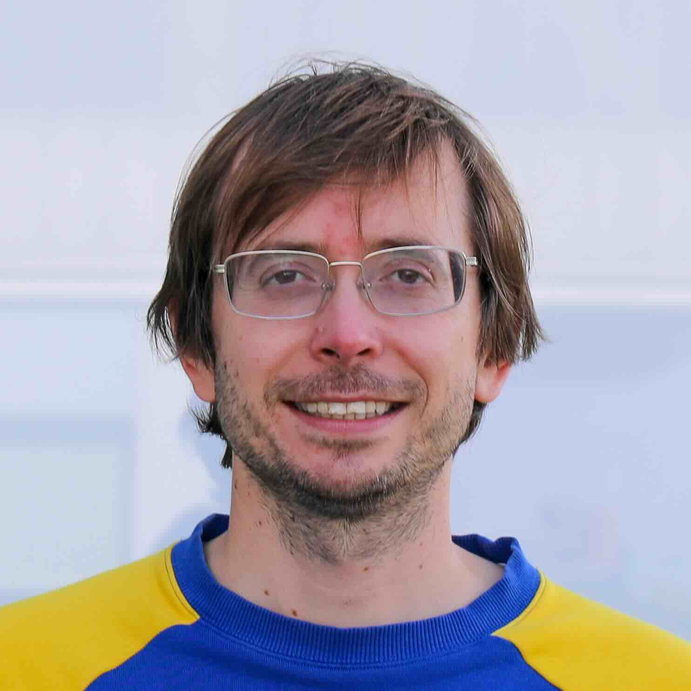
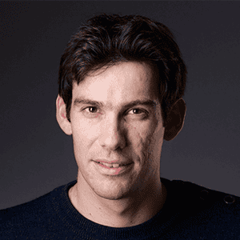
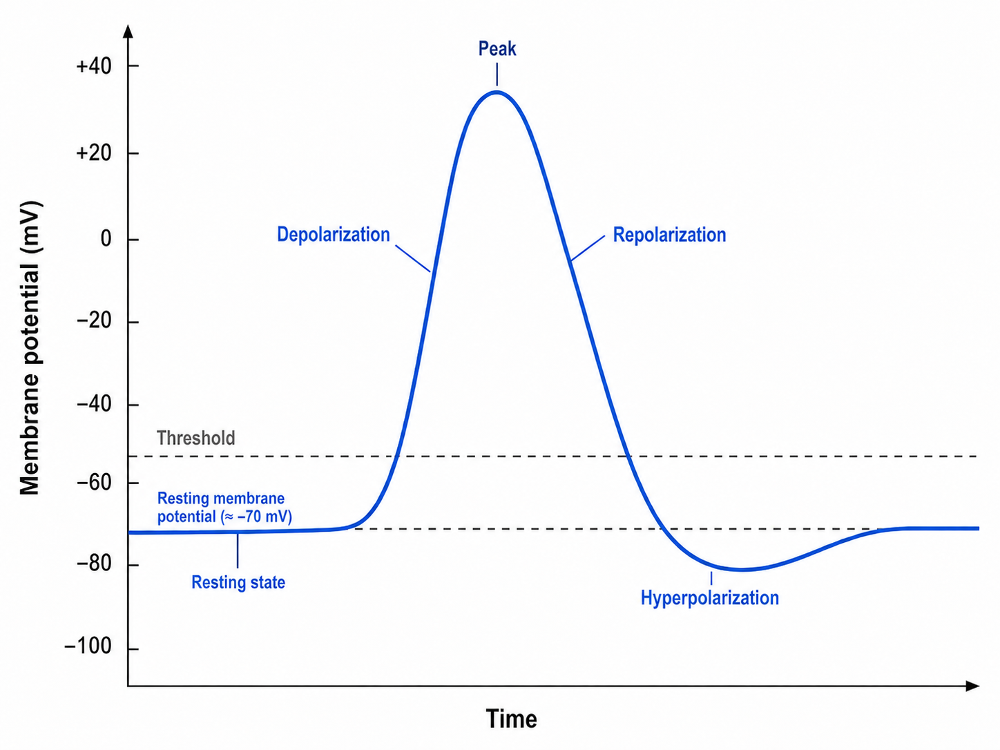
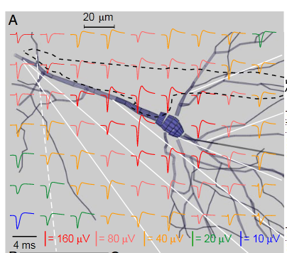
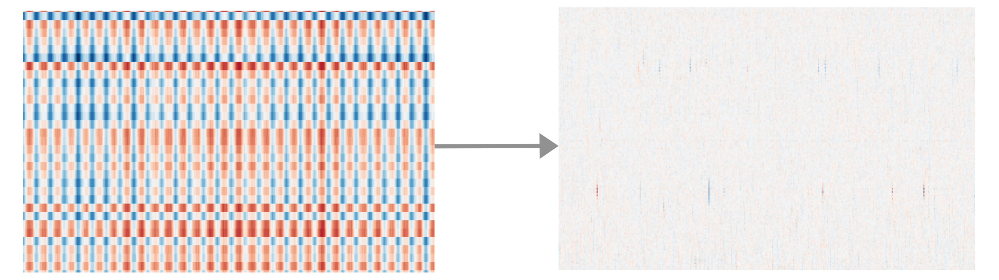
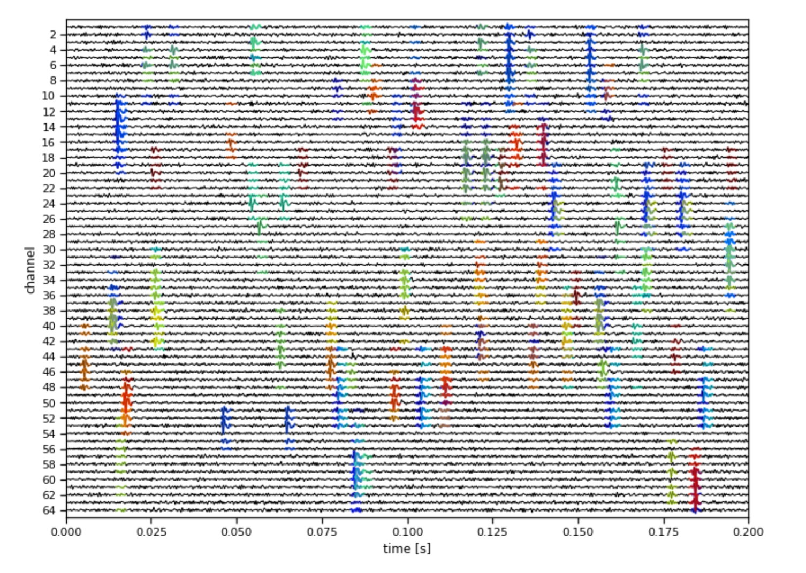
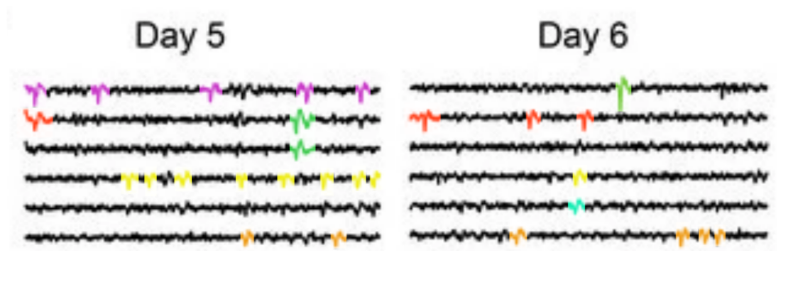
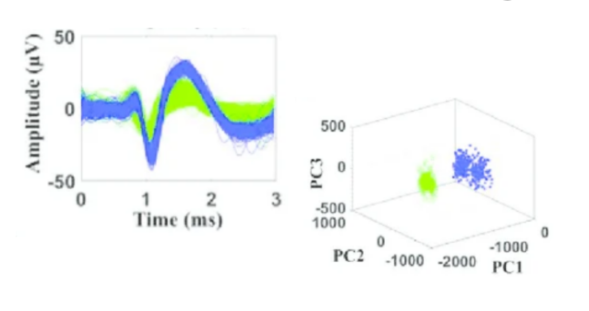
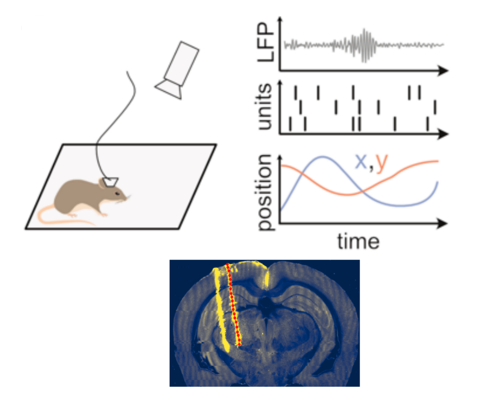
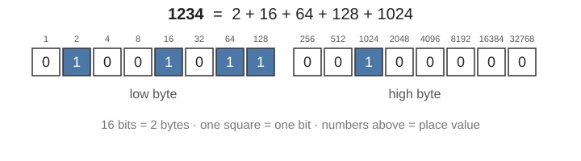

## The instructor team 

::: {.instructor-grid}

{.instructor-photo}\
Enny van Beest 

{.instructor-photo}\
Alessio Buccino

{.instructor-photo}\
Chris Halcrow

{.instructor-photo}\
Olivier Winter

{.instructor-photo}\
Wolf De Wulf

{.instructor-photo}\
Joe Ziminski

:::

## Course objectives {.ephys-process-slide}

- Gain hands-on experience implementing an extracellular electrophysiology pipeline
- Introduce the underlying theory of the processing steps
- Have fun! meet people, collaborate, and discuss your own data

## Timeline

::: {style="font-size: 0.62em; line-height: 1.25;"}

<table style="width: 100%; border-collapse: separate; border-spacing: 1.2rem 0.45rem;">
  <thead>
    <tr>
      <th style="padding: 0.15rem 0.35rem;">Session</th>
      <th style="padding: 0.15rem 0.35rem;">When</th>
    </tr>
  </thead>
  <tbody>
    <tr>
      <td style="padding: 0.15rem 0.35rem;"><strong>Session 1: Introduction</strong></td>
      <td style="padding: 0.15rem 0.35rem;">Monday, 10:00-13:00</td>
    </tr>
    <tr>
      <td style="padding: 0.15rem 0.35rem;"><strong>Session 2: Data quality and preprocessing</strong></td>
      <td style="padding: 0.15rem 0.35rem;">Tuesday, 10:00-13:00</td>
    </tr>
    <tr>
      <td style="padding: 0.15rem 0.35rem;"><strong>Session 3: Sorting and UnitMatch</strong></td>
      <td style="padding: 0.15rem 0.35rem;">Tuesday, 14:00-17:00</td>
    </tr>
    <tr>
      <td style="padding: 0.15rem 0.35rem;"><strong>Session 4: Postprocessing and Curation</strong></td>
      <td style="padding: 0.15rem 0.35rem;">Wednesday, 10:00-13:00</td>
    </tr>
    <tr>
      <td style="padding: 0.15rem 0.35rem;"><strong>Session 5: Analysis (Pynapple and Probe-anatomy alignment)</strong></td>
      <td style="padding: 0.15rem 0.35rem;">Wednesday, 14:00-17:00</td>
    </tr>
  </tbody>
</table>

:::

## Today's session
1. Course Introduction
2. Introduction to extracellular electrophysiology
3. Coding a full pipeline with SpikeInterface

## Course book

- We will work through the course book available at: \
[neuroinformatics.dev/course_ephys_osss](https://neuroinformatics.dev/course_ephys_osss/)

- Feel free to open this link now (these slides are Chapter 2).
- We will work through Chapter 3 today.

## Coding section

- We will go through core sections together, with time for exercises and free coding
- Writing code by hand improves understanding
    - (avoid using LLMs)
- This is particularly true for debugging - if stuck, ask your neighbor or a TA!

## &nbsp; {.math-goal-slide}

:::: {.math-goal-grid}

::: {.math-goal-quote style="grid-column: 1 / span 2; grid-row: 1; justify-self: start; max-width: 34rem; margin-left: 3rem; margin-top: -1.5rem;"}
So each of these breakthroughs, they are the culmination of, and couldn't exist without, the many months of stumbling around in the dark that precede them.

**Andrew Wiles**, solved Fermat's Last Theorem
:::

::: {.math-goal-quote style="grid-column: 2 / span 2; grid-row: 1; justify-self: end; max-width: 36rem; margin-right: 2.5rem;"}
Focusing on important questions puts us in the awkward position of being ignorant. One of the beautiful things about science is that it allows us to bumble along, getting it wrong time after time, and feel perfectly fine as long as we learn something each time.

[**Martin Schwartz**](https://journals.biologists.com/jcs/article/121/11/1771/30038/The-importance-of-stupidity-in-scientific-research), professor of cell biology
:::

::: {.math-goal-quote style="grid-column: 1; grid-row: 2;"}
If I spend an entire day and all I do is understand this one feature of this one object that I didn't understand before, then that's a great day.

**PhD student**
:::

::: {.math-goal-center style="grid-column: 2; grid-row: 2;"}
Being comfortable<br>in confusion
:::

::: {.math-goal-quote style="grid-column: 3; grid-row: 2;"}
My advisor once told me that doing science is 98% being confused and 2% figuring it out.

**PhD student**
:::

::: {.math-goal-quote style="grid-column: 2; grid-row: 3; text-align: center; margin: 0.25rem auto 0;"}
When you allow yourself to be confused you become far more introspective; you gain the clarity you desire by questioning and reconciling a variety of ideas and alternatives that may feel overwhelming.

[**Peter Winick**](https://thoughtleadershipleverage.com/embracing-confusion/), CEO of *Thought Leadership*
:::

::::

## Your own data

- We welcome you trying out the methods discussed on your own data
- Please feel free to ask questions related to your own data at any point
- If you are already familiar with the concepts covered in exercises, feel free to apply the methods discussed on your own data

## Introduction to extracellular electrophysiology {.section-title-slide}

## Method overview {.ephys-process-slide}

::: {.ephys-process-figures}
<div class="ephys-process-left-figure">
  
  
</div>

<div class="ephys-tuning-figure">
  
</div>
:::

::: {.ephys-process-grid}
<div class="ephys-step"><strong>1.</strong> Implant recording electrode</div>
<div class="ephys-step"><span class="fragment" data-fragment-index="1"><strong>2.</strong> Record during behavior of interest</span></div>
<div class="ephys-step"><span class="fragment" data-fragment-index="2"><strong>3.</strong> Identify action potentials in the recorded trace</span></div>
<div class="ephys-step"><span class="fragment" data-fragment-index="3"><strong>4.</strong> Assign action potentials to neurons with spike sorting</span></div>
<div class="ephys-step"><span class="fragment" data-fragment-index="4"><strong>5.</strong> Understand how neural activity encodes behavior</span></div>
:::


## Classic findings {.classic-video-slide}

:::: {.columns}

::: {.column width="50%"}
### Orientation selectivity (Hubel and Wiesel, 1962)

::: {.classic-video-frame}

:::

:::

::: {.column width="50%"}
### Hippocampal space encoding

::: {.classic-video-frame}

:::

:::

::::

## In the clinic {.clinic-video-slide}

::: {.clinic-video-frame}

:::

## Evolution of recording devices

{.slide-image-centered fig-alt="Timeline of recording devices"}

## Extracellular electrophysiological data {data-transition="none"}

{fig-alt="Extracellular electrophysiology line traces across channels"}

## Extracellular electrophysiological data {data-transition="none"}

{fig-alt="Extracellular electrophysiology spatial map view"}

## The action potential {data-transition="none"}

:::: {.columns}

::: {.column width="50%"}
### Intracellular

{fig-alt="Intracellular action potential waveform phases" style="display: block; width: 92%; max-height: 500px; margin: 0 auto; object-fit: contain;"}
:::

::: {.column width="50%"}
### Extracellular

{fig-alt="Extracellular action potential voltage field around a neuron from Gold et al. 2006" style="display: block; width: 92%; max-height: 500px; margin: 0 auto; object-fit: contain;"}
:::

::::

## Pros and cons {.ephys-compare-slide}

:::: {.ephys-compare-grid}

::: {.ephys-compare-col}
{.ephys-compare-image fig-alt="Targeted deep electrophysiology recording and traces"}

<h3 class="ephys-compare-title">Electrophysiology</h3>

- ✅ High temporal resolution
- ✅ Targeted to deep and multiple regions
- ❌ Cannot easily identify individual neurons
:::

::: {.ephys-compare-col}
{.ephys-compare-image fig-alt="Two-photon imaging field of view with labeled neurons"}

<h3 class="ephys-compare-title">Imaging</h3>

- ✅ Easy identification of individual neurons (genetically targetable)
- ❌ Low temporal resolution
- ❌ Limited depth and field of view
:::

::::

## The recording setup

{fig-alt="Electrode to amplifier to analog to digital conversion to computer recording setup"}

## Preprocessing

{fig-alt="Preprocessing step" style="display: block; width: 100%; max-height: 590px; margin: 0 auto; object-fit: contain;"}

## &nbsp; {.no-title-space}

:::: {.columns}

::: {.column width="50%"}
<h3 style="font-size: 1.6em; text-align: center; margin-top: -1.4em;">Sorting</h3>

{fig-alt="Spike sorting step" style="display: block; width: 100%; max-height: 560px; margin: 0 auto; object-fit: contain;"}
:::

::: {.column width="50%"}
<h3 style="font-size: 1.6em; text-align: center; margin-top: -1.4em;">UnitMatching</h3>

{fig-alt="UnitMatching step" style="display: block; width: 100%; max-height: 560px; margin: 0 auto; object-fit: contain;"}
:::

::::

## Postprocessing

{fig-alt="Postprocessing step" style="display: block; width: 60%; max-height: 420px; margin: 0 auto; object-fit: contain;"}

## Analysis

{fig-alt="Analysis step" style="display: block; width: 100%; max-height: 590px; margin: 0 auto; object-fit: contain;"}

## SpikeInterface

::: {style="font-size: 0.72em; line-height: 1.08; margin-top: -0.25rem; margin-bottom: 0.2rem;"}
A common API for open-source electrophysiological tools
:::

{fig-alt="SpikeInterface common API for open-source electrophysiological tools" style="display: block; width: 100%; max-height: 590px; margin: 0 auto; object-fit: contain; object-position: center top;"}

## Building a pipeline in Python {.section-title-slide}

## Course setup

- The setup instructions are on the 'Python setup' page of the course handbook:

[neuroinformatics.dev/course_ephys_osss/setup](https://neuroinformatics.dev/course_ephys_osss/setup.html)

- We will go through it together now
- ✅ uv environment linked to IDE

## Downloading data for the course {.data-download-slide}

Download everything you need for the course from:

- The [course Zenodo repository](https://zenodo.org/records/21908611) — all core datasets.
  - ✅ `sub-001_ses-001_g0_t0.imec0.ap.bin`
  - ✅ `sub-001_ses-001_g0_t0.imec0.ap.meta`
- The **AL032** dataset from [Dropbox](https://www.dropbox.com/scl/fo/1019utuiqbogkyxeqpm8a/AKov2FuY5XZfx5JjIEVuoO4?rlkey=1xcxyki0ijktmxz1k62qg07hh&st=4rrisszb&e=1&dl=0) — UnitMatch chapter.
- *(optional)* The larger **EB055** dataset from the same Dropbox — UnitMatch extended exercises.

## Python imports

```python
from pathlib import Path
import matplotlib.pyplot as plt
import spikeinterface.full as si
from probeinterface.plotting import plot_probe
from spikeinterface_gui import run_mainwindow

print("Finished importing")
```

## Data checks {data-transition="none"}

```
SpikeGLXRecordingExtractor: 384 channels - 30.0kHz - 1 segments - 75,000 samples - 2.50s
                            int16 dtype - 54.93 MiB
```

::: {style="font-size: 0.8em;"}

- **Samples**: 2.50 s × 30,000 Hz = **75,000 samples** per channel
- **Bytes**: 75,000 samples × 2 bytes × 384 channels = **57,600,000 bytes**
- = 57.6 MB (megabytes, ÷1000³) = **54.93 MiB** (mebibytes, ÷1024³)

:::

Each sample is stored as a 16-bit integer (`int16`) — that is 2 bytes:

{fig-alt="Sixteen squares, one per bit, grouped into two bytes, showing a 16-bit integer in binary" style="display: block; width: 70%; margin: 0.5em auto 0 auto;"}

