::: {.incremental}
1. Introduction to extracellular electrophysiology
2. Coding a pipeline with SpikeInterface
3. Downloading data for the course
:::

## Introduction to extracellular electrophysiology {.section-title-slide}

## Overview {.ephys-process-slide}

::: {.ephys-process-figures}

  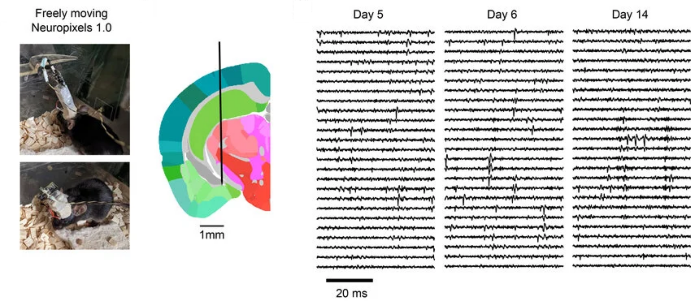
  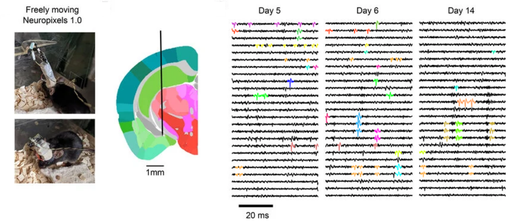

  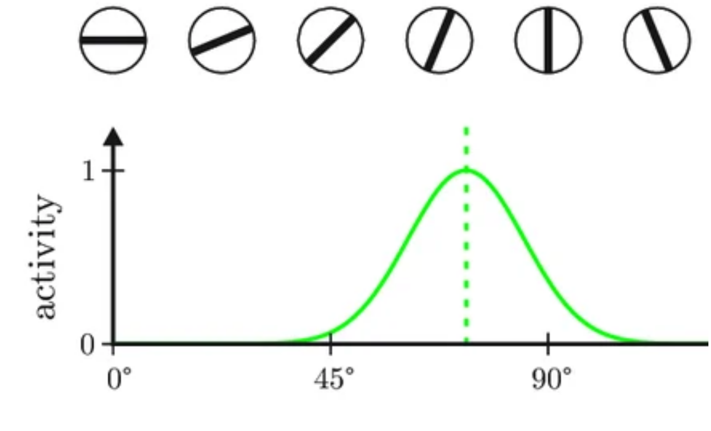

:::

::: {.ephys-process-grid}

<strong>1.</strong> Implant recording electrode

<strong>2.</strong> Record during behaviour of interest

<strong>3.</strong> Identify action potentials in the recorded trace

<strong>4.</strong> Assign action potentials to neurons with spike sorting

<strong>5.</strong> Understand how neural activity encodes behaviour

:::

## Pros and cons {.ephys-compare-slide}

:::: {.ephys-compare-grid}

::: {.ephys-compare-col}
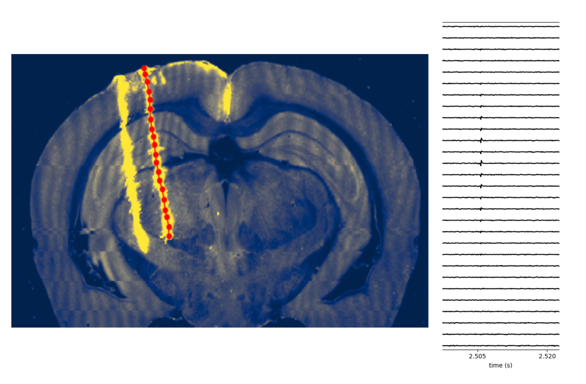{.ephys-compare-image fig-alt="Targeted deep electrophysiology recording and traces"}

<h3 class="ephys-compare-title">Electrophysiology</h3>

- ✅ High temporal resolution
- ✅ Targetted to deep and multiple regions
- ❌ Cannot easily identify individual neurons
:::

::: {.ephys-compare-col}
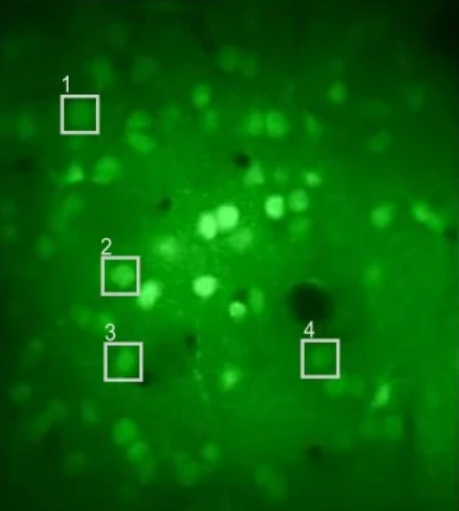{.ephys-compare-image fig-alt="Two-photon imaging field of view with labelled neurons"}

<h3 class="ephys-compare-title">Imaging</h3>

- ✅ Easy identification of individual neurons (genetically targetable)
- ❌ Low temporal resolution
- ❌ Limited depth and field of view
:::

::::

## Classic findings

:::: {.columns}

::: {.column width="50%"}
### Orientation selectivity (Hubel and Wiesel, 1962)

<iframe class="video-embed video-embed-classic video-embed-center" src="https://www.youtube-nocookie.com/embed/IOHayh06LJ4" title="Hubel and Wiesel orientation selectivity" frameborder="0" allow="accelerometer; autoplay; clipboard-write; encrypted-media; gyroscope; picture-in-picture; web-share" allowfullscreen></iframe>

:::

::: {.column width="50%"}

### Motor population encoding (Georgopoulos, 1986)

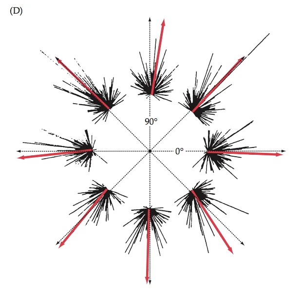{.classic-findings-image fig-alt="Georgopoulos 1986 motor population encoding figure"}

:::

::::

## &nbsp; {.classic-findings-continuation}

:::: {.columns}

::: {.column width="50%"}
### Hippocampal space encoding

Place cells

<iframe class="video-embed video-embed-place-cell" src="https://www.youtube-nocookie.com/embed/STyd1qJr3yM" title="Hippocampal place cells" frameborder="0" allow="accelerometer; autoplay; clipboard-write; encrypted-media; gyroscope; picture-in-picture; web-share" allowfullscreen></iframe>

Theta phase precession

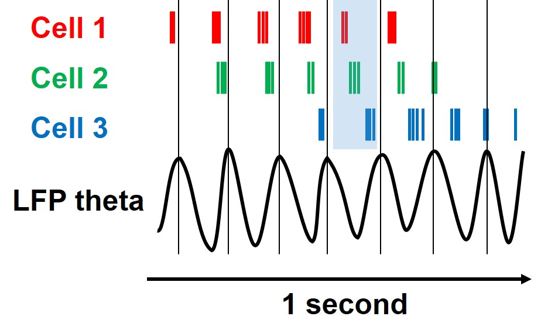{.classic-findings-image-medium .classic-findings-image-compact fig-alt="Theta phase precession example"}
:::

::: {.column width="50%"}

### Brain-wide map (The International Brain Laboratory et al., 2023)

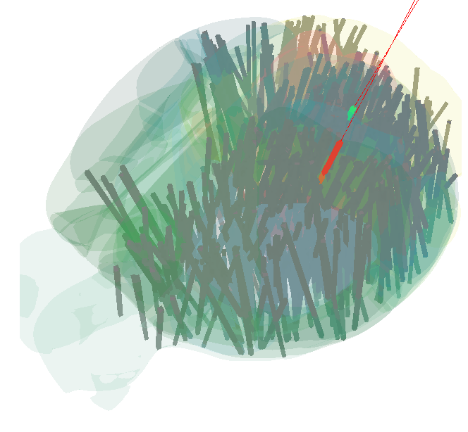{.classic-findings-image fig-alt="International Brain Laboratory brain-wide map"}

:::

::::

## In the clinic

<iframe class="video-embed video-embed-clinic video-embed-center" src="https://www.youtube-nocookie.com/embed/iTZ2N-HJbwA" title="Recording example" frameborder="0" allow="accelerometer; autoplay; clipboard-write; encrypted-media; gyroscope; picture-in-picture; web-share" allowfullscreen></iframe>

## Evolution of recording devices

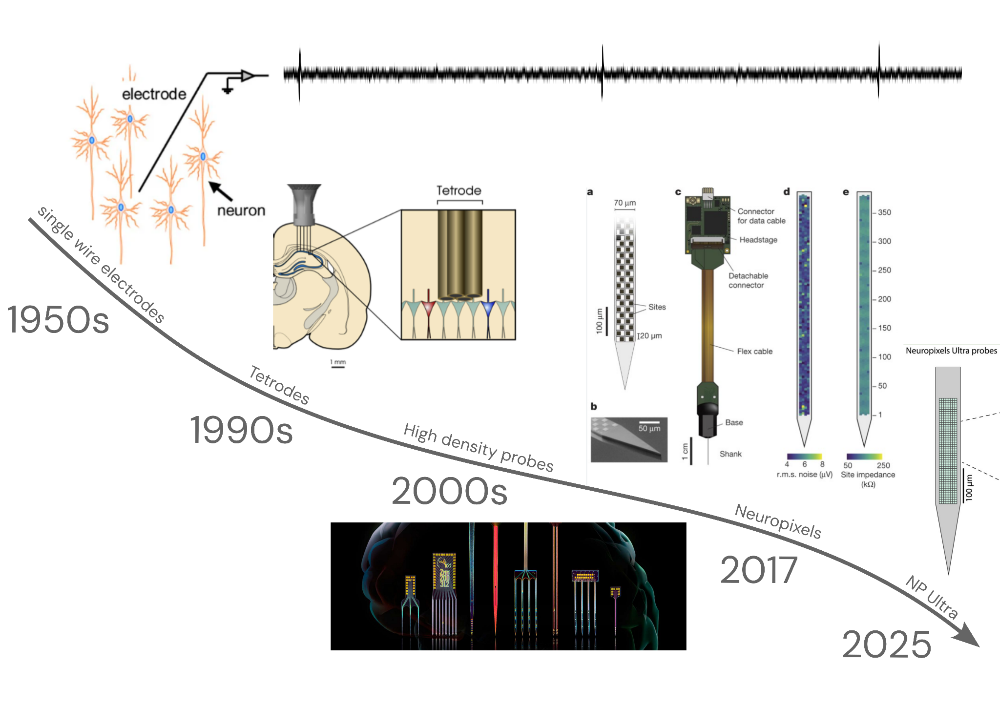{.slide-image-centered fig-alt="Timeline of recording devices"}

## The recording set up

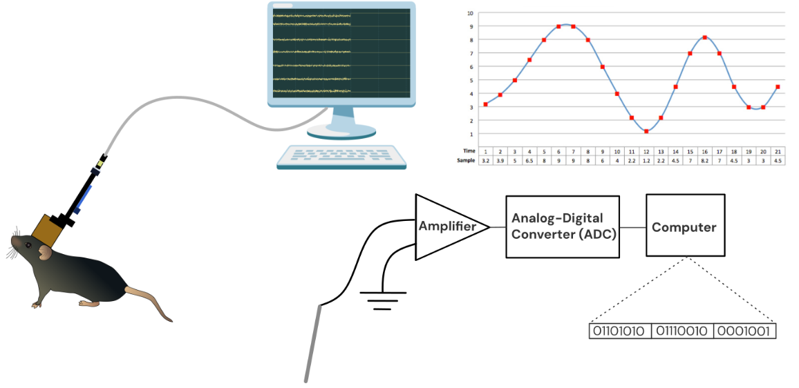{fig-alt="Electrode to amplifier to analog to digital conversion to computer recording setup"}

## Extracellular electrophysiological data {data-transition="none"}

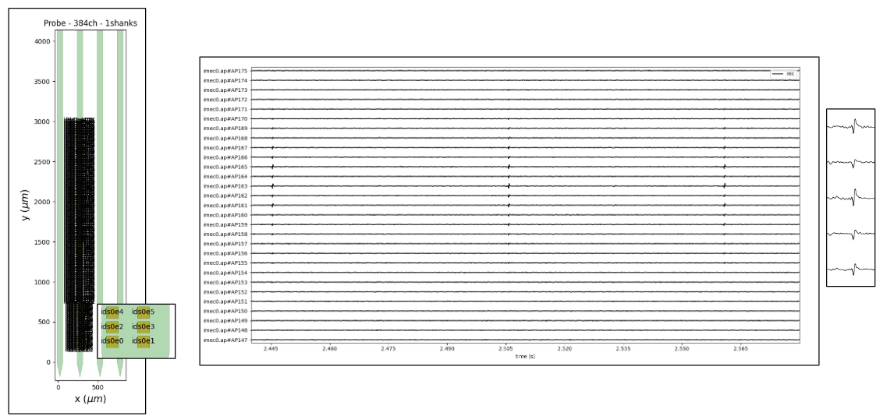{fig-alt="Extracellular electrophysiology line traces across channels"}

## Extracellular electrophysiological data {data-transition="none"}

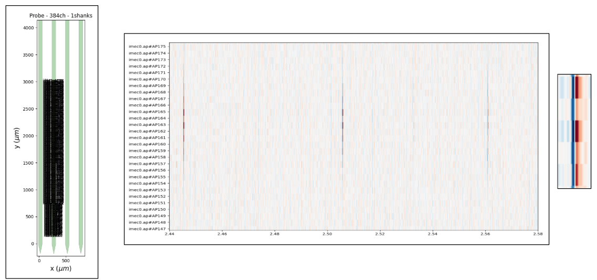{fig-alt="Extracellular electrophysiology spatial map view"}

## The sorting pipeline

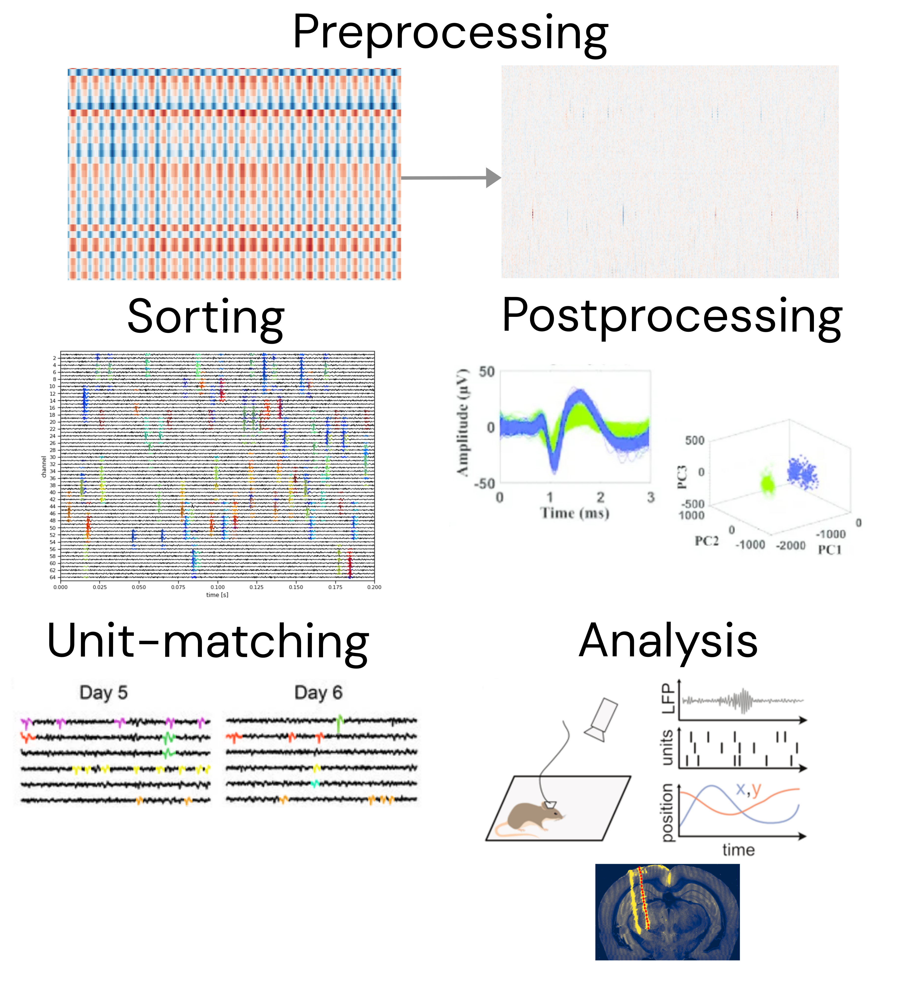{fig-alt="Spike sorting pipeline steps" style="display: block; width: 100%; max-height: 590px; margin: 0 auto; object-fit: contain;"}

## SpikeInterface

::: {style="font-size: 0.72em; line-height: 1.08; margin-top: -0.25rem; margin-bottom: 0.2rem;"}
A common API for open-source electrophysiological tools
:::

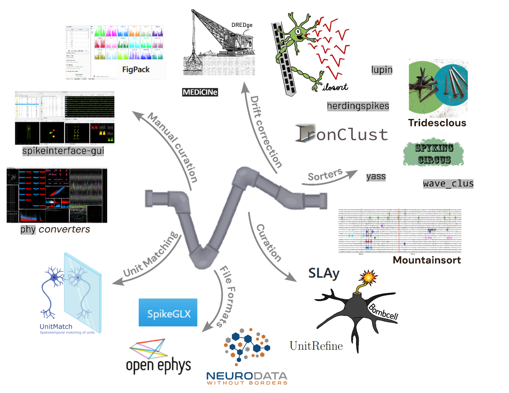{fig-alt="SpikeInterface common API for open-source electrophysiological tools" style="display: block; width: 100%; max-height: 660px; margin: -0.15rem auto 0; object-fit: contain; object-position: center top;"}

## Course timeline

::: {style="font-size: 0.62em; line-height: 1.25;"}

<table style="width: 100%; border-collapse: separate; border-spacing: 1.2rem 0.45rem;">
  <thead>
    <tr>
      <th style="padding: 0.15rem 0.35rem;">Session</th>
      <th style="padding: 0.15rem 0.35rem;">When</th>
    </tr>
  </thead>
  <tbody>
    <tr>
      <td style="padding: 0.15rem 0.35rem;"><strong>Session 1: Introduction</strong></td>
      <td style="padding: 0.15rem 0.35rem;">Monday, 10:00-13:00</td>
    </tr>
    <tr>
      <td style="padding: 0.15rem 0.35rem;"><strong>Session 2: Raw data quality and preprocessing</strong></td>
      <td style="padding: 0.15rem 0.35rem;">Tuesday, 10:00-13:00</td>
    </tr>
    <tr>
      <td style="padding: 0.15rem 0.35rem;"><strong>Session 3: Sorting</strong></td>
      <td style="padding: 0.15rem 0.35rem;">Tuesday, 14:00-17:00</td>
    </tr>
    <tr>
      <td style="padding: 0.15rem 0.35rem;"><strong>Session 4: Sorting quality, postprocessing, and curation</strong></td>
      <td style="padding: 0.15rem 0.35rem;">Wednesday, 10:00-13:00</td>
    </tr>
    <tr>
      <td style="padding: 0.15rem 0.35rem;"><strong>Session 5: Analysing outputs (Pynapple and probe alignment)</strong></td>
      <td style="padding: 0.15rem 0.35rem;">Wednesday, 14:00-17:00</td>
    </tr>
  </tbody>
</table>

:::

## &nbsp; {.math-goal-slide}

:::: {.math-goal-grid}

::: {.math-goal-quote style="grid-column: 1 / span 2; grid-row: 1; justify-self: start; max-width: 34rem; margin-left: 3rem; margin-top: -1.5rem;"}
So each of these breakthroughs, they are the culmination of, and couldn't exist without, the many months of stumbling around in the dark that precede them.

**Andrew Wiles**, solved Fermat's last theorem
:::

::: {.math-goal-quote style="grid-column: 2 / span 2; grid-row: 1; justify-self: end; max-width: 36rem; margin-right: 2.5rem;"}
Focusing on important questions puts us in the awkward position of being ignorant. One of the beautiful things about science is that it allows us to bumble along, getting it wrong time after time, and feel perfectly fine as long as we learn something each time.

[**Martin Schwartz**](https://journals.biologists.com/jcs/article/121/11/1771/30038/The-importance-of-stupidity-in-scientific-research), professor of cell biology
:::

::: {.math-goal-quote style="grid-column: 1; grid-row: 2;"}
If I spend an entire day and all I do is understand this one feature of this one object that I didn't understand before, then that's a great day.

**PhD student**
:::

::: {.math-goal-center style="grid-column: 2; grid-row: 2;"}
Being comfortable in confusion
:::

::: {.math-goal-quote style="grid-column: 3; grid-row: 2;"}
My advisor once told me that doing science is 98% being confused and 2% figuring it out.

**PhD student**
:::

::: {.math-goal-quote style="grid-column: 2; grid-row: 3; text-align: center; margin: 0.25rem auto 0;"}
When you allow yourself to be confused you become far more introspective; you gain the clarity you desire by questioning and reconciling a variety of ideas and alternatives that may feel overwhelming.

[**Peter Winick**](https://thoughtleadershipleverage.com/embracing-confusion/)
:::

::::

## Let's start coding! {.section-title-slide}

## Course set up

The course handbook, with set up instructions, is at:

[https://neuroinformatics.dev/course_ephys_osss/](https://neuroinformatics.dev/course_ephys_osss/)

Head to the [set up page](https://neuroinformatics.dev/course_ephys_osss/setup.html) and we'll go through it together.

::: {.notes}
Open the set up page and take everyone through the installation steps together.
:::

## Downloading data for the course {.data-download-slide}

:::: {.data-download-grid}

::: {.data-download-section}
[DANDI datasets]{.data-download-title}

- preprocessing / sorting:
- postprocessing:
- analysis:
:::

::: {.data-download-section}
[UnitMatch]{.data-download-title}

- main dataset:
- extra dataset:
:::

::::

